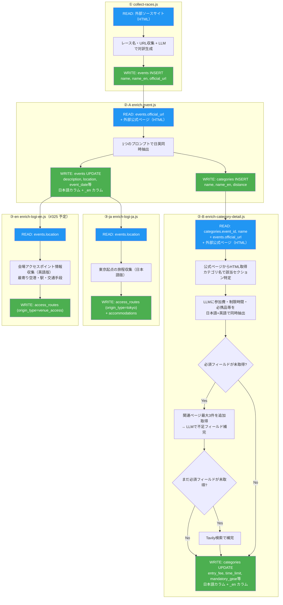
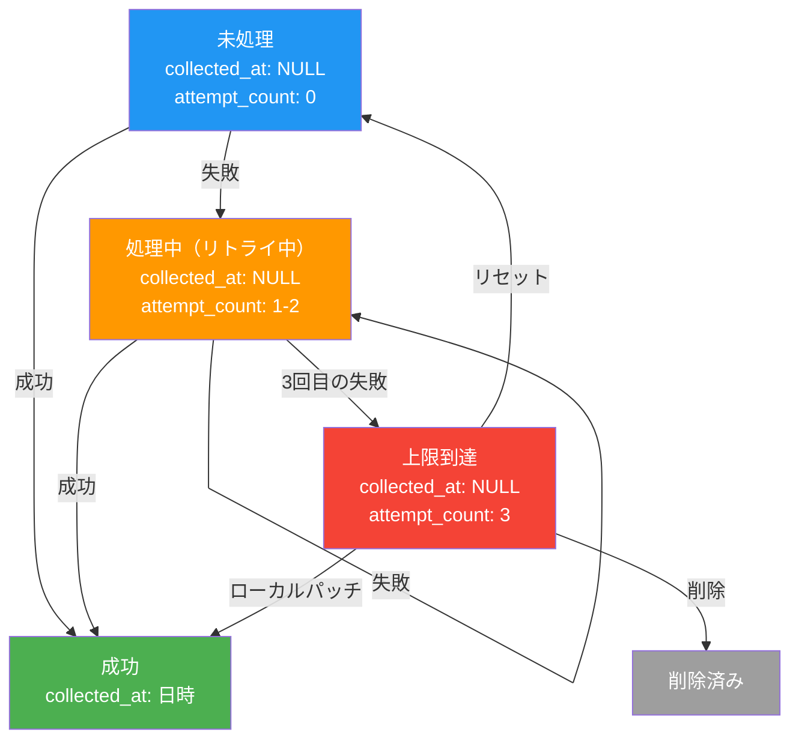

# バックエンド処理フロー（概要）

クロール・データ収集の処理の流れ。詳細は各スクリプトの設計書を参照。

---

## スクリプト構成

| # | スクリプト | 役割 | 設計書 |
|---|------------|------|--------|
| ① | `collect-races.js` | 各ソースからレース名・URL を収集 → events に投入（LLMで name_en 同時生成） | [SPEC_CRAWL_COLLECT_RACES.md](./SPEC_CRAWL_COLLECT_RACES.md) |
| ②-A | `enrich-event.js` | 公式ページ + LLM でイベント基本情報・コース一覧を日英同時抽出 | [SPEC_CRAWL_ENRICH_EVENT.md](./SPEC_CRAWL_ENRICH_EVENT.md) |
| ②-B | `enrich-category-detail.js` | コース単位で詳細情報（参加費・制限時間・必携品等）を日英同時抽出 | [SPEC_CRAWL_ENRICH_CATEGORY_DETAIL.md](./SPEC_CRAWL_ENRICH_CATEGORY_DETAIL.md) |
| ③-ja | `enrich-logi-ja.js` | アクセス・宿泊情報を収集（東京起点、日本語版） | ※ #325 で改名予定。現在は `enrich-logi.js` |
| ③-en | `enrich-logi-en.js` | 会場アクセスポイント情報を収集（英語版） | ※ #325 で新規作成予定 |
| ④ | `orchestrator.js` | ②-A → ②-B → ③-ja → ③-en を順に呼び出す司令塔 | [SPEC_CRAWL_ORCHESTRATOR.md](./SPEC_CRAWL_ORCHESTRATOR.md) |

ユーティリティ:

| スクリプト | 役割 |
|------------|------|
| `lib/enrich-utils.js` | ②-A / ②-B 共有のユーティリティ（HTML取得・LLM呼び出し・Tavily検索等） |
| `sources/*.js` | ① のソースサイト別パーサープラグイン（42ファイル） |
| `reset-for-bilingual.js` | #316 一回限りリセットスクリプト |
| `reclassify-other.js` | race_type=other の一括再分類（メンテナンス用） |

廃止済み:

| スクリプト | 廃止理由 |
|------------|---------|
| `enrich-translate.js` | #316 で廃止。全ステップで日英同時抽出に統一 |
| `enrich-detail.js` | 旧版。②-A + ②-B を1スクリプトで実行（CLI後方互換用） |

---

## 全体フロー



### 1イベントあたりの処理順序

```
②-A enrichEvent            → イベント情報 + コース特定
                               ↓
②-B enrichCategoryDetail × N → 各コースの詳細情報（1コース1LLM呼び出し）
                               ↓
③-ja enrichLogiJa           → 東京起点の旅程（日本語版）
③-en enrichLogiEn           → 会場アクセスポイント（英語版）※#325 で追加予定
```

---

## リトライポリシー（#316）

### 基本方針

- **全エラー即リトライ**（クールダウンなし、エラー種別による分岐なし）
- **上限3回で停止** → Telegramレポートに上限到達件数を表示
- 切り分けは上限到達後に `/enrich-triage` スキルで人が行う

### バッチ対象判定クエリ（events・categories 共通）

```sql
WHERE collected_at IS NULL AND attempt_count < 3
```

### 成功の定義

必須フィールドテンプレートで定義されたフィールドがすべて埋まった場合に `collected_at = NOW()` を設定。

- 共通テンプレート（②-B）: `entry_fee`
- 種別テンプレート: #318 で順次追加（現在は空）

### 状態遷移



---

## 実行順序

```bash
# 1. レース名収集
npm run crawl:collect

# 2. イベント情報・カテゴリ詳細・ロジ収集（オーケストレータ経由）
npm run crawl:orchestrate
```

GitHub Actions で自動実行（3つのワークフローに分離）:
- `crawl-collect.yml`: レース名収集（1日3回 06:00/14:00/22:00 JST）
- `crawl-enrich-events.yml`: ②-A + ③ + コスト集計（10分おき）
- `crawl-enrich-categories.yml`: ②-B（10分おき）

---

## 設計原則

### コース vs 申込区分

**コース**（categories テーブルに格納）:
- 距離・ルートが異なるもの（例: フルマラソン / ハーフマラソン / 10km）

**申込区分**（格納しない）:
- 同じコースの性別/年齢/会員種別の違い（例: 男子10km / 女子10km / R.LEAGUE 10km）
- Wave start の違い（例: Wave 1 / Wave 2）
- エントリー時期の違い（例: 早期申込 / 通常申込 / レイトエントリー）

### バイリンガル対応（#316）

- 全ステップで1プロンプト・日英同時抽出
- 翻訳ジョブ（⑤ enrich-translate.js）は廃止
- 日本語カラムと `_en` カラムを同時に書き込み

### 必須フィールドテンプレート

フォールバック（関連ページ・Tavily）と成功判定に使用。詳細は `docs/FIELD_MATRIX.md` を参照。

```
共通テンプレート ∪ 種別テンプレート = 最終必須リスト
```

### ③ ロジ収集の言語分離（#325 予定）

| バッチ | 用途 | 起点 | origin_type |
|--------|------|------|-------------|
| ③-ja | 日本語版 | 東京 | tokyo |
| ③-en | 英語版 | 会場アクセスポイント（最寄り空港・駅） | venue_access |

英語版は起点を固定せず、会場側のアクセスポイント一覧を提示する。フロントエンドで `origin_type` に応じて表示を切り替え。

---

## 関連ドキュメント

- [SPEC_CRAWL_COLLECT_RACES.md](./SPEC_CRAWL_COLLECT_RACES.md)
- [SPEC_CRAWL_ENRICH_EVENT.md](./SPEC_CRAWL_ENRICH_EVENT.md)
- [SPEC_CRAWL_ENRICH_CATEGORY_DETAIL.md](./SPEC_CRAWL_ENRICH_CATEGORY_DETAIL.md)
- [SPEC_CRAWL_ENRICH_LOGI.md](./SPEC_CRAWL_ENRICH_LOGI.md)
- [SPEC_CRAWL_ORCHESTRATOR.md](./SPEC_CRAWL_ORCHESTRATOR.md)
- [SPEC_DATA_SOURCES.md](./SPEC_DATA_SOURCES.md)
- [SPEC_RACE_DATA.md](./SPEC_RACE_DATA.md)
- [FIELD_MATRIX.md](./FIELD_MATRIX.md)
