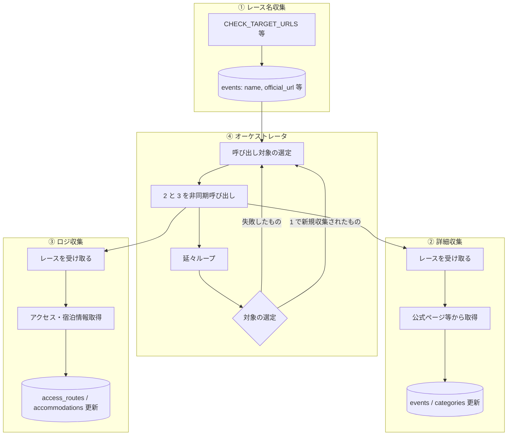
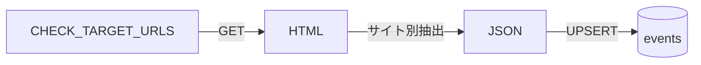
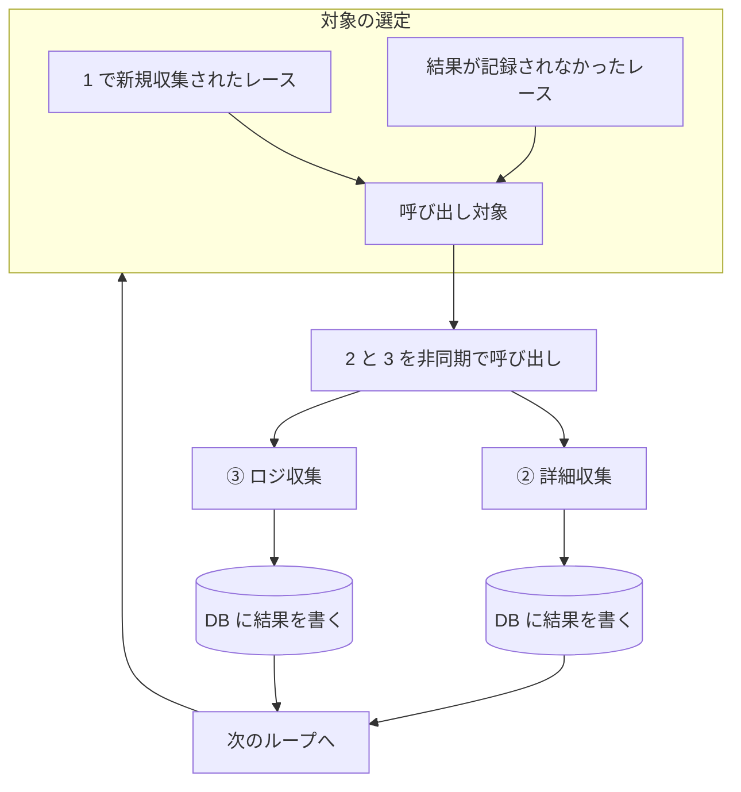
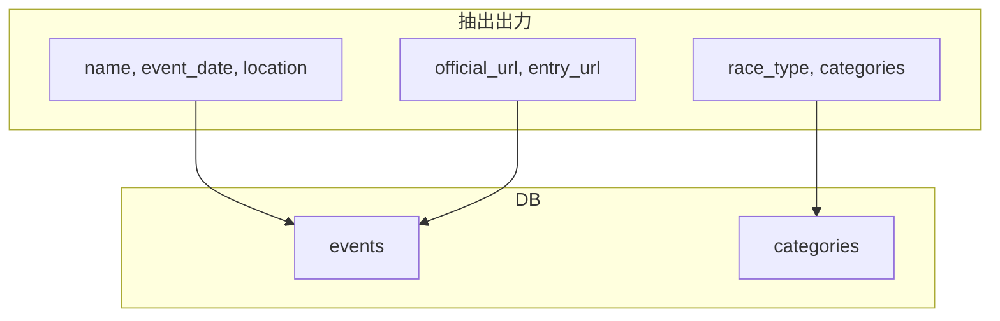
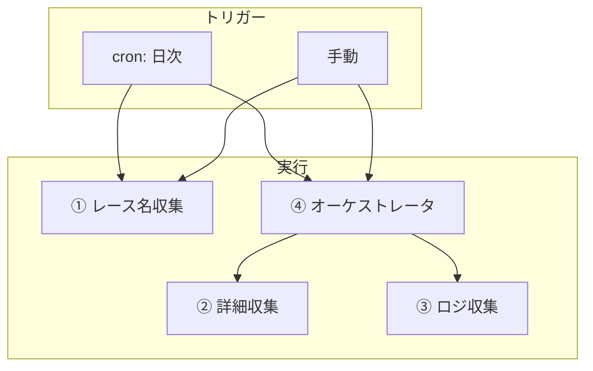

# バックエンド処理フロー

クロール・データ収集の処理の流れを整理。**認識合わせ用**。

---

## 1. スクリプトの種類（4 種）

| # | スクリプト | 役割 |
|---|------------|------|
| 1 | **レース名収集** | 各ソースからレース名をひたすら収集。events に name, official_url 等を投入 |
| 2 | **詳細収集** | 呼び出し元から与えられたレースの詳細情報（カテゴリ、申込、スペック等）をひたすら収集 |
| 3 | **ロジ収集** | 呼び出し元から与えられたレースのロジ情報（アクセス、宿泊等）をひたすら収集 |
| 4 | **オーケストレータ** | 2 と 3 を呼び出す。タイムアウトの都合上**非同期**で呼び出す。結果は子に書かせる。**結果の記録が無かったもの（＝失敗）**と**1 で新しく収集されたもの**を延々呼び出す |

---

## 2. 全体フロー（俯瞰）

**オーケストレータのループ**:
- 対象 = **結果が記録されなかったもの（失敗）** + **1 で新規収集されたもの**
- 2 と 3 を非同期で呼び出し、子が DB に結果を書く
- 失敗・新規を延々呼び出し続ける

---

## 3. ① レース名収集

各ソース（CHECK_TARGET_URLS 等）からレース一覧を取得し、events に投入。  
レース特定に必要な情報（name, official_url 等）が取れれば十分。サイト別の取得フローは [SPEC_CRAWL_PHASE_FLOW.md](./SPEC_CRAWL_PHASE_FLOW.md) を参照。

---

## 4. ② 詳細収集

呼び出し元（オーケストレータ）からレースを受け取り、公式ページ等から詳細情報を取得。  
events / categories を更新。カテゴリ、申込、スペック等。

---

## 5. ③ ロジ収集

呼び出し元（オーケストレータ）からレースを受け取り、アクセス・宿泊情報を取得。  
access_routes / accommodations を更新。東京起点の経路・所要時間・現金要否・シャトル等。他都市は将来拡張。

---

## 6. ④ オーケストレータ（詳細）

- **タイムアウト対策**: 2 と 3 は非同期で呼び出す（子プロセス or 並列実行）
- **結果の記録**: 子（2, 3）が DB に直接書く。記録が無い = 失敗として再呼び出し対象
- **ループ**: 失敗 + 新規を延々呼び出し続ける

---

## 7. ① の抽出結果形式（#20 で検証済み）

抽出スクリプトが返す JSON のイメージ。DB 投入時にマッピングする。

| フィールド例 | 説明 |
|--------------|------|
| `name` | 大会名 |
| `event_date` | 開催日（YYYY-MM-DD） |
| `location` | 開催地 |
| `official_url` | 公式 URL（識別キー候補） |
| `entry_url` | 申込 URL |
| `race_type` | トレラン / スパルタン / 等 |
| `categories` | カテゴリ配列（name, distance_km, elevation_gain, entry_fee 等） |

詳細は [SPEC_RACE_DATA.md](./SPEC_RACE_DATA.md) を参照。

---

## 8. 実行環境・トリガー

| 項目 | 案 |
|------|-----|
| トリガー | **手動**で即時実行。cron は後から追加 |
| 実行場所 | ローカル or GitHub Actions workflow_dispatch |

---

## 9. 関連ドキュメント

| ドキュメント | 内容 |
|--------------|------|
| [SPEC_CRAWL_PHASE_FLOW.md](./SPEC_CRAWL_PHASE_FLOW.md) | フェーズ1/2 分離・サイト別取得フロー |
| [SPEC_CRAWL_DESIGN.md](./SPEC_CRAWL_DESIGN.md) | 変更検知・抽出戦略の詳細 |
| [SPEC_DATA_STRUCTURE.md](./SPEC_DATA_STRUCTURE.md) | テーブル構成・格納原則 |
| [SPEC_RACE_DATA.md](./SPEC_RACE_DATA.md) | 大会データ項目仕様 |
| [CHECK_TARGET_URLS.md](./data-sources/CHECK_TARGET_URLS.md) | チェック対象 URL 一覧 |
