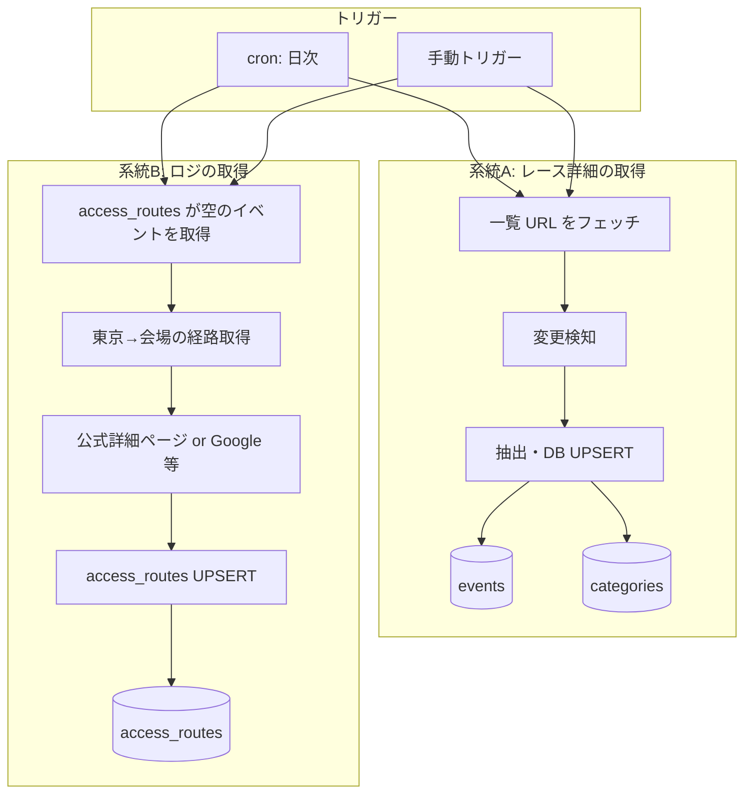
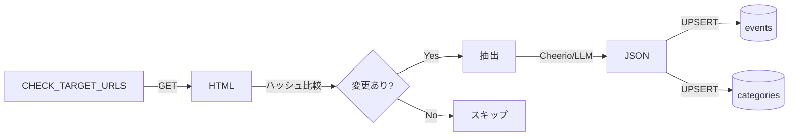
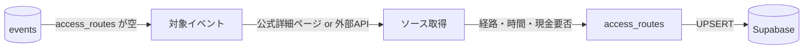
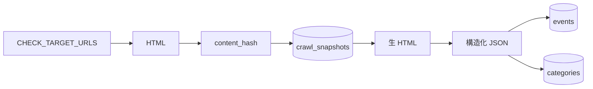
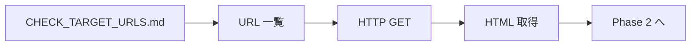
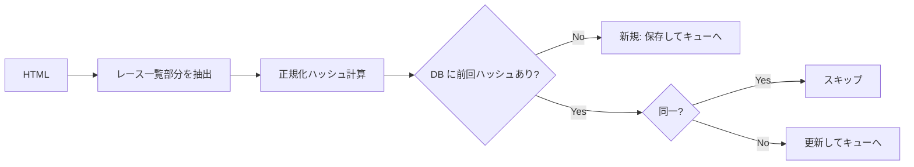
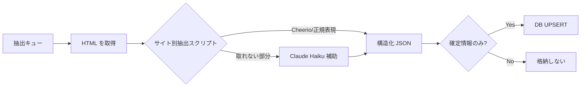
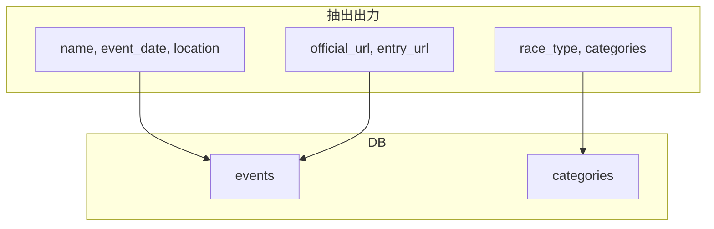
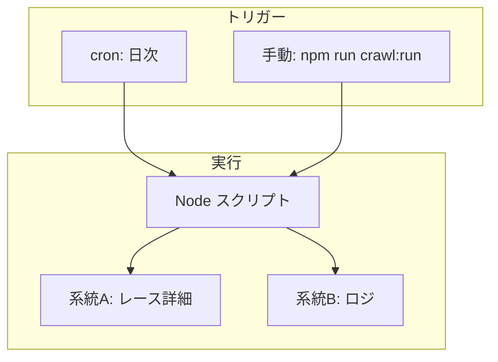

# バックエンド処理フロー

クロール・データ収集の処理の流れを整理。**認識合わせ用**。

バックエンドは大きく **2 系統** に分かれる:

1. **レース自体の詳細を取得** — 一覧ページから新規・更新を検知し、events / categories を DB に投入
2. **ロジを取得** — 東京起点のアクセス（経路・所要時間・現金要否・シャトル等）を取得し、access_routes 等に投入

---

## 1. 全体フロー（俯瞰）

---

## 2. 系統A: レース詳細の取得（一覧→抽出→DB）

| 対象 | 一覧ページ（A-Extremo, Golden Trail 等） |
|------|----------------------------------------|
| 出力 | 大会名・日付・URL・場所・カテゴリ |
| トリガー | cron または 手動（`npm run crawl:run` 等） |

---

## 3. 系統B: ロジの取得（東京起点のアクセス）

| 対象 | access_routes が空のイベント |
|------|-----------------------------|
| 起点 | 東京（初期は東京固定） |
| 取得項目 | 経路・乗り換え、所要時間、費用概算、現金要否、シャトル等 |
| ソース | 公式詳細ページのスクレイピング、Google Directions API 等 |

※ 他都市は将来拡張。

---

## 4. データの流れ（系統A 詳細）

---

## 5. 各フェーズの詳細（系統A）

### Phase 1: フェッチ

| 項目 | 内容 |
|------|------|
| 入力 | チェック対象 URL 一覧 |
| 出力 | 各 URL の HTML レスポンス |
| コスト | 無料 |
| 実行場所 | Node スクリプト（axios/fetch） |

---

### Phase 2: 変更検知

| 項目 | 内容 |
|------|------|
| 入力 | HTML、source_url |
| 出力 | 変更あり → 抽出キューへ / 変更なし → スキップ |
| 保存先 | `crawl_snapshots`（source_url, content_hash, fetched_at） |
| コスト | 無料 |

---

### Phase 3: 抽出

| 項目 | 内容 |
|------|------|
| 入力 | 変更があった URL の HTML |
| 出力 | events / categories 用の構造化 JSON |
| 方式 | 優先: スクレイピング → 補助: LLM |
| コスト | LLM 使用時のみ発生 |

---

## 6. 抽出結果の形式（#20 で検証済み）

抽出スクリプトが返す JSON のイメージ。DB 投入時にマッピングする。

| フィールド例 | 説明 |
|--------------|------|
| `name` | 大会名 |
| `event_date` | 開催日（YYYY-MM-DD） |
| `location` | 開催地 |
| `official_url` | 公式 URL（識別キー候補） |
| `entry_url` | 申込 URL |
| `race_type` | トレラン / スパルタン / 等 |
| `categories` | カテゴリ配列（name, distance_km, elevation_gain, entry_fee 等） |

詳細は [SPEC_RACE_DATA.md](./SPEC_RACE_DATA.md) を参照。

---

## 7. 実行環境・トリガー

| 項目 | 案 |
|------|-----|
| トリガー | **手動**（`npm run crawl:run`）で即時実行。cron は後から追加 |
| 対象 | 初期は少数ソース（A-Extremo, Golden Trail 等） |
| 実行場所 | ローカル or GitHub Actions workflow_dispatch |

---

## 8. 関連ドキュメント

| ドキュメント | 内容 |
|--------------|------|
| [SPEC_CRAWL_DESIGN.md](./SPEC_CRAWL_DESIGN.md) | 変更検知・抽出戦略の詳細 |
| [SPEC_DATA_STRUCTURE.md](./SPEC_DATA_STRUCTURE.md) | テーブル構成・格納原則 |
| [SPEC_RACE_DATA.md](./SPEC_RACE_DATA.md) | 大会データ項目仕様 |
| [CHECK_TARGET_URLS.md](./data-sources/CHECK_TARGET_URLS.md) | チェック対象 URL 一覧 |
