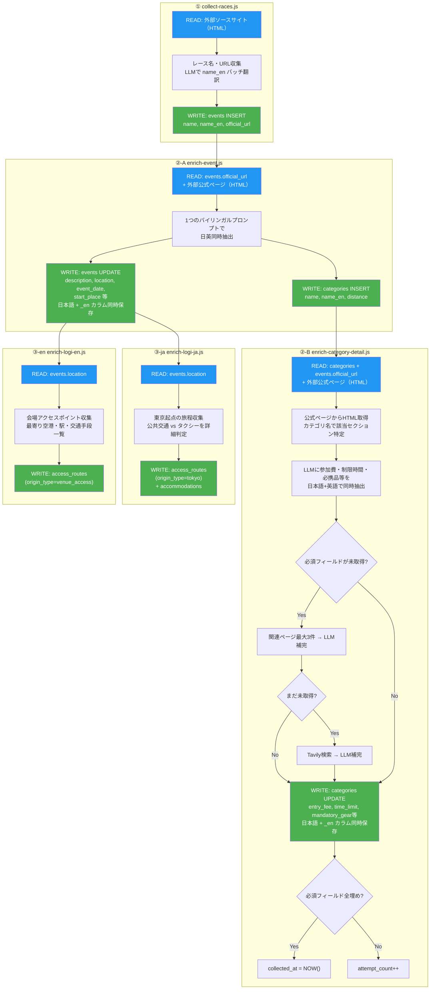
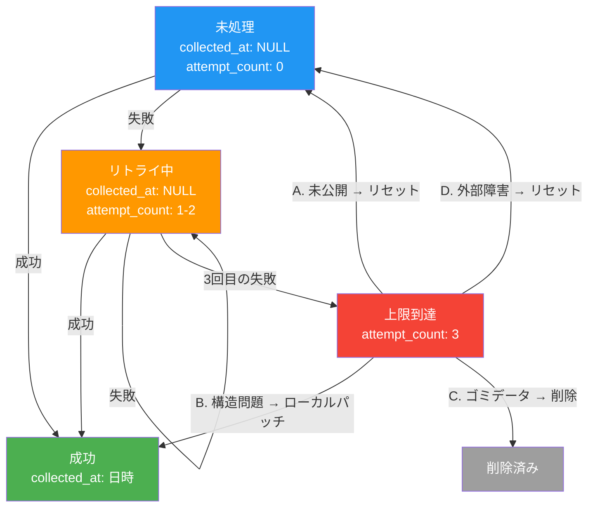

# バックエンド処理フロー

クロール・データ収集パイプラインの設計書。

---

## スクリプト構成

| # | スクリプト | 役割 | IN | OUT |
|---|------------|------|-----|------|
| ① | `collect-races.js` | 各ソースからレース名・URL 収集 + LLMで name_en 同時生成 | 外部ソースサイト（HTML） | events INSERT（name, name_en, official_url） |
| ②-A | `enrich-event.js` | 公式ページからイベント基本情報・コース一覧を日英同時抽出 | events.official_url + 外部公式ページ | events UPDATE + categories INSERT |
| ②-B | `enrich-category-detail.js` | コース単位で詳細情報を日英同時抽出（必須テンプレートによるフォールバック制御） | categories + events.official_url + 外部公式ページ | categories UPDATE |
| ③-ja | `enrich-logi-ja.js`（現 `enrich-logi.js`） | 東京起点の旅程収集（日本語版）。タクシー要否を詳細判定 | events.location | access_routes（origin_type=tokyo） + accommodations |
| ③-en | `enrich-logi-en.js`（#325 で新規作成） | 会場アクセスポイント情報収集（英語版） | events.location | access_routes（origin_type=venue_access） |
| ④ | `orchestrator.js` | ②-A → ②-B → ③-ja → ③-en を順に呼び出す司令塔 + コスト集計 | events（未処理分） | - |

### ユーティリティ

| スクリプト | 役割 |
|------------|------|
| `lib/enrich-utils.js` | HTML取得・LLM呼び出し・Tavily検索・言語検出等の共有ユーティリティ |
| `sources/*.js` | ① のソースサイト別パーサープラグイン（39ファイル） |

### 廃止済み

| スクリプト | 廃止理由 |
|------------|---------|
| `enrich-translate.js` | #316 で廃止。全ステップで日英同時抽出に統一したため不要 |
| `enrich-detail.js` | 旧版②。CLI後方互換用 |

---

## 全体フロー



---

## 各ジョブの詳細

### ① collect-races.js

ソースサイト別パーサープラグイン（`sources/*.js`）を動的ロードし、レース名・URLを収集。

- プラグインは `SOURCE_URLS`（固定URL）または `matchesUrl()`（URL判定）を実装
- 収集後、LLM（Haiku）でバッチ翻訳（20件単位）→ `name_en` 生成
- `events` に INSERT（重複は `official_url` or `(name, event_date)` でスキップ）

### ②-A enrich-event.js

1つのバイリンガルプロンプトで公式ページから全情報を日英同時抽出。

**抽出フィールド（events）:**
name, name_en, description, description_en, location, location_en, country, country_en, event_date, event_date_end, race_type, entry_url, entry_type, entry_start, entry_end, participant_count, stay_status, start_place, start_place_en, weather_forecast, weather_forecast_en, visa_info, visa_info_en, recovery_facilities, recovery_facilities_en, photo_spots, photo_spots_en

**抽出フィールド（categories INSERT）:**
name, name_en, distance_km

### ②-B enrich-category-detail.js

カテゴリ単位で詳細情報を日英同時抽出。必須フィールドテンプレートによるフォールバック制御。

**抽出フィールド:**
entry_fee, entry_fee_currency, start_time, reception_end, time_limit, cutoff_times, elevation_gain, mandatory_gear, mandatory_gear_en, recommended_gear, recommended_gear_en, prohibited_items, prohibited_items_en, reception_place, reception_place_en, start_place, start_place_en, poles_allowed, itra_points, finish_rate

**フォールバックフロー:**
```
公式ページ → LLM抽出（全フィールド）
  ↓ 必須フィールドが未取得?
関連ページ最大3件 → LLM補完
  ↓ まだ必須フィールドが未取得?
Tavily検索 → LLM補完（検索クエリは未取得フィールドに応じて動的生成）
  ↓
必須フィールドがすべて埋まった → collected_at = NOW()（成功）
必須フィールドが残っている → attempt_count++（リトライ対象）
```

**バリデーション:**
- start_time: "TBA"/"TBC" → NULL、wave範囲（"08:00-20:30"）→ TEXT保存
- entry_fee: 小数 → Math.round、parseFloat 後に parseInt
- time_limit: 各種表記（"8h", "60 minutes" 等）→ HH:MM:SS 正規化

### ③-ja enrich-logi-ja.js（日本語版）

東京起点の旅程を収集。Google Routes API + LLM。

**出力:**
- access_routes: 往路/復路の経路詳細、所要時間、費用（origin_type = 'tokyo'）
- accommodations: 推奨エリア、宿泊費目安

**公共交通判定（#329）:**
- `transit_accessible`: "full"（公共交通のみ）/ "partial"（駅まで公共交通+タクシー）/ "none"（タクシー/レンタカー推奨）
- partial の場合: タクシー必要区間と料金目安を明記

### ③-en enrich-logi-en.js（英語版、#325 で新規作成）

会場アクセスポイント情報を収集。起点を固定せず、会場側の到達方法を提示。

**出力:**
- access_routes（origin_type = 'venue_access'）

**出力イメージ:**
```
最寄り空港:
- Geneva Airport (GVA) — 75km, bus 2h or rental car 1.5h
- Lyon-Saint Exupéry Airport (LYS) — 220km, rental car 2.5h

最寄り駅:
- Chamonix-Mont-Blanc station (SNCF)

会場アクセス:
- Geneva → Chamonix: FlixBus / SAT bus, 2h, ~€30
```

**③-ja とのコンテキスト分離:**
別プロセスで実行し、LLMコンテキストの汚染を防止。

---

## DBカラム

### events

| カラム | 型 | 用途 | 書き込みバッチ |
|--------|-----|------|-------------|
| attempt_count | INT DEFAULT 0 | 試行回数 | ②-A / orchestrator |
| last_error_type | TEXT | エラー分類 | ②-A / orchestrator |
| last_error_message | TEXT | エラー詳細 | ②-A / orchestrator |
| collected_at | TIMESTAMP | enrich完了日時 | ②-A |

### categories

| カラム | 型 | 用途 | 書き込みバッチ |
|--------|-----|------|-------------|
| attempt_count | INT DEFAULT 0 | 試行回数 | ②-B |
| last_error_type | TEXT | エラー分類 | ②-B |
| last_error_message | TEXT | エラー詳細 | ②-B |
| collected_at | TIMESTAMP | enrich完了日時 | ②-B |

### access_routes（#325 で追加予定）

| カラム | 型 | 用途 |
|--------|-----|------|
| origin_type | TEXT | 'tokyo'（日本語版）or 'venue_access'（英語版） |

---

## リトライポリシー

### 基本方針

- **全エラー即リトライ**（クールダウンなし、エラー種別による分岐なし）
- **上限3回で停止** → Telegramレポートに上限到達件数を表示
- 切り分けは上限到達後に `/enrich-triage` スキルで人が行う

### バッチ対象判定クエリ（events・categories 共通）

```sql
WHERE collected_at IS NULL AND attempt_count < 3
```

### 成功の定義

必須フィールドテンプレートで定義されたフィールドがすべて埋まった場合に `collected_at = NOW()`。

- 共通テンプレート（②-B）: `entry_fee`
- 種別テンプレート: #318 で順次追加（現在は空）
- テンプレートは追加方式（必須カラム名を列挙するだけ。全カラムの要否管理はしない）
- 詳細は `docs/FIELD_MATRIX.md` を参照

### 状態遷移



### 上限到達後の対応（/enrich-triage）

1. `attempt_count >= 3` のレコード一覧取得
2. `last_error_type` / `last_error_message` + 公式ページを確認し原因調査
3. 調査レポート出力（A.未公開 / B.構造問題 / C.ゴミデータ / D.外部障害 に分類）
4. アクション案提示 → **ユーザー承認待ち**
5. 承認後にアクション実行 + 結果レポート

---

## GitHub Actions ワークフロー

| ワークフロー | スケジュール | 実行内容 |
|-------------|------------|---------|
| `crawl-collect.yml` | 1日3回（06:00/14:00/22:00 JST） | ① collect-races |
| `crawl-enrich-events.yml` | 10分おき | ②-A + ③-ja + コスト集計 |
| `crawl-enrich-categories.yml` | 10分おき | ②-B |

---

## 設計原則

### コース vs 申込区分

**コース**（categories テーブルに格納）:
- 距離・ルートが異なるもの（例: フルマラソン / ハーフマラソン / 10km）

**申込区分**（格納しない）:
- 同じコースの性別/年齢/会員種別の違い
- Wave start の違い
- エントリー時期の違い

### バイリンガル対応

- 全ステップで1プロンプト・日英同時抽出
- 翻訳ジョブは廃止
- 日本語カラムと `_en` カラムを同時に書き込み

### ③ ロジ収集の言語分離

| バッチ | 用途 | 内容 | origin_type |
|--------|------|------|-------------|
| ③-ja | 日本語版 | 東京起点の旅程。公共交通 vs タクシーを詳細判定 | tokyo |
| ③-en | 英語版 | 会場アクセスポイント（最寄り空港・駅・交通手段一覧）。起点は固定しない | venue_access |

別プロセスで実行し、LLMコンテキストの汚染を防止する。

---

## 関連ドキュメント

- [FIELD_MATRIX.md](./FIELD_MATRIX.md) — 表示項目×取得バッチ対応表・必須フィールドテンプレート
- [SPEC_CRAWL_COLLECT_RACES.md](./SPEC_CRAWL_COLLECT_RACES.md)
- [SPEC_CRAWL_ENRICH_EVENT.md](./SPEC_CRAWL_ENRICH_EVENT.md)
- [SPEC_CRAWL_ENRICH_CATEGORY_DETAIL.md](./SPEC_CRAWL_ENRICH_CATEGORY_DETAIL.md)
- [SPEC_CRAWL_ENRICH_LOGI.md](./SPEC_CRAWL_ENRICH_LOGI.md)
- [SPEC_CRAWL_ORCHESTRATOR.md](./SPEC_CRAWL_ORCHESTRATOR.md)
- [SPEC_DATA_SOURCES.md](./SPEC_DATA_SOURCES.md)
- [SPEC_RACE_DATA.md](./SPEC_RACE_DATA.md)
