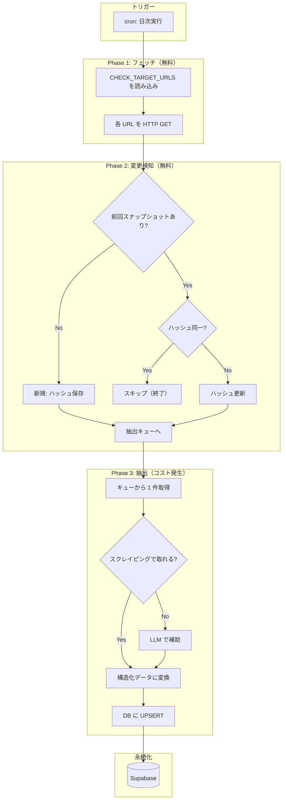
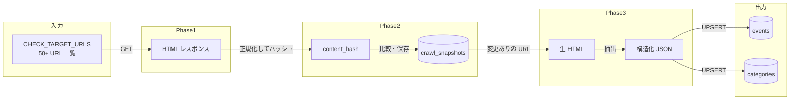
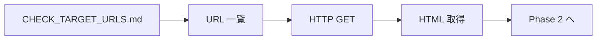
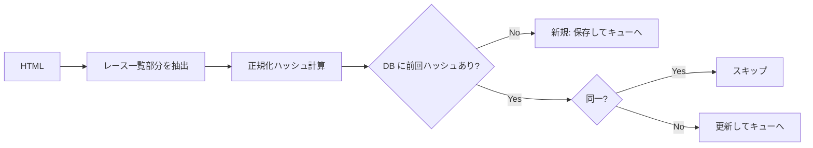
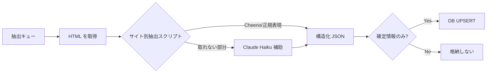
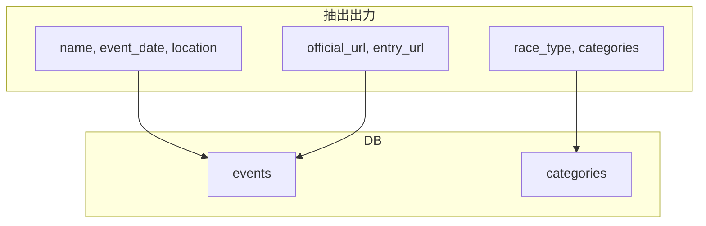
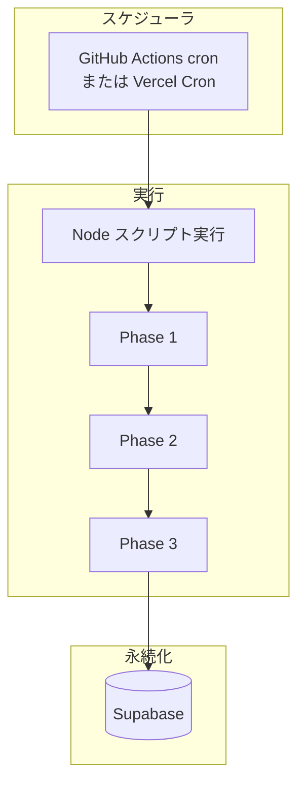

# バックエンド処理フロー

クロール・データ収集の処理の流れを整理。**認識合わせ用**。

---

## 1. 全体フロー（俯瞰）

---

## 2. データの流れ（入出力）

---

## 3. 各フェーズの詳細

### Phase 1: フェッチ

| 項目 | 内容 |
|------|------|
| 入力 | チェック対象 URL 一覧 |
| 出力 | 各 URL の HTML レスポンス |
| コスト | 無料 |
| 実行場所 | Node スクリプト（axios/fetch） |

---

### Phase 2: 変更検知

| 項目 | 内容 |
|------|------|
| 入力 | HTML、source_url |
| 出力 | 変更あり → 抽出キューへ / 変更なし → スキップ |
| 保存先 | `crawl_snapshots`（source_url, content_hash, fetched_at） |
| コスト | 無料 |

---

### Phase 3: 抽出

| 項目 | 内容 |
|------|------|
| 入力 | 変更があった URL の HTML |
| 出力 | events / categories 用の構造化 JSON |
| 方式 | 優先: スクレイピング → 補助: LLM |
| コスト | LLM 使用時のみ発生 |

---

## 4. 抽出結果の形式（#20 で検証する出力）

抽出スクリプトが返す JSON のイメージ。DB 投入時にマッピングする。

| フィールド例 | 説明 |
|--------------|------|
| `name` | 大会名 |
| `event_date` | 開催日（YYYY-MM-DD） |
| `location` | 開催地 |
| `official_url` | 公式 URL（識別キー候補） |
| `entry_url` | 申込 URL |
| `race_type` | トレラン / スパルタン / 等 |
| `categories` | カテゴリ配列（name, distance_km, elevation_gain, entry_fee 等） |

詳細は [SPEC_RACE_DATA.md](./SPEC_RACE_DATA.md) を参照。

---

## 5. 実行環境・スケジュール

| 項目 | 案 |
|------|-----|
| トリガー | 日次（例: 毎朝 6:00 JST） |
| 実行場所 | GitHub Actions / Vercel Cron / 外部（未定） |
| 所要時間 | Phase 1+2: 数分 / Phase 3: 変更量による |

---

## 6. 関連ドキュメント

| ドキュメント | 内容 |
|--------------|------|
| [SPEC_CRAWL_DESIGN.md](./SPEC_CRAWL_DESIGN.md) | 変更検知・抽出戦略の詳細 |
| [SPEC_DATA_STRUCTURE.md](./SPEC_DATA_STRUCTURE.md) | テーブル構成・格納原則 |
| [SPEC_RACE_DATA.md](./SPEC_RACE_DATA.md) | 大会データ項目仕様 |
| [CHECK_TARGET_URLS.md](./data-sources/CHECK_TARGET_URLS.md) | チェック対象 URL 一覧 |
