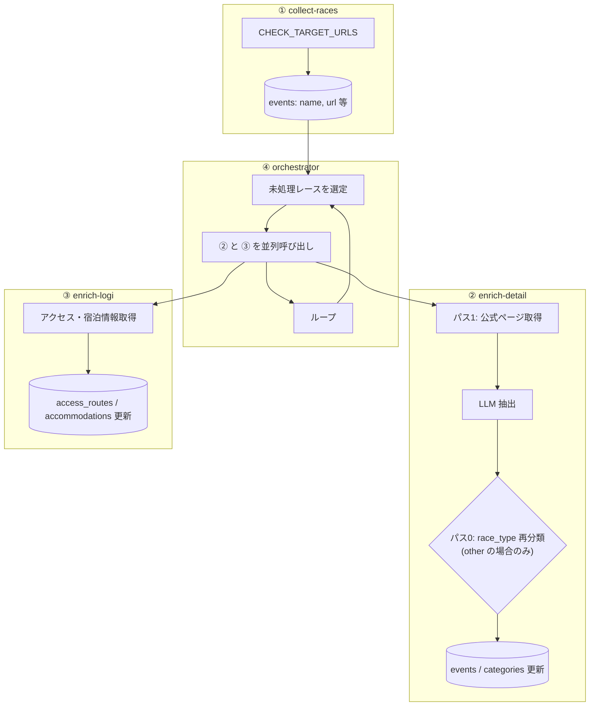

# バックエンド処理フロー（概要）

クロール・データ収集の処理の流れ。詳細は各スクリプトの設計書を参照。

---

## スクリプト構成（4種 + ユーティリティ）

| # | スクリプト | 役割 | 設計書 |
|---|------------|------|--------|
| ① | `collect-races.js` | 各ソースからレース名・URL を収集 → events に投入 | [SPEC_CRAWL_COLLECT_RACES.md](./SPEC_CRAWL_COLLECT_RACES.md) |
| ② | `enrich-detail.js` | 公式ページ + LLM でカテゴリ・詳細情報を収集 | [SPEC_CRAWL_ENRICH_DETAIL.md](./SPEC_CRAWL_ENRICH_DETAIL.md) |
| ③ | `enrich-logi.js` | アクセス・宿泊情報を収集（東京起点） | [SPEC_CRAWL_ENRICH_LOGI.md](./SPEC_CRAWL_ENRICH_LOGI.md) |
| ④ | `orchestrator.js` | ② と ③ を呼び出す司令塔。未処理を延々処理 | [SPEC_CRAWL_ORCHESTRATOR.md](./SPEC_CRAWL_ORCHESTRATOR.md) |
| - | `reclassify-other.js` | race_type=other の一括再分類（メンテナンス用） | 本ドキュメント参照 |

---

## 全体フロー



---

## 実行順序

```bash
# 1. レース名収集
npm run crawl:collect

# 2. 詳細・ロジ収集（オーケストレータ経由）
npm run crawl:orchestrate
```

---

## 関連ドキュメント

- [SPEC_CRAWL_COLLECT_RACES.md](./SPEC_CRAWL_COLLECT_RACES.md)
- [SPEC_CRAWL_ENRICH_DETAIL.md](./SPEC_CRAWL_ENRICH_DETAIL.md)
- [SPEC_CRAWL_ENRICH_LOGI.md](./SPEC_CRAWL_ENRICH_LOGI.md)
- [SPEC_CRAWL_ORCHESTRATOR.md](./SPEC_CRAWL_ORCHESTRATOR.md)
- [SPEC_DATA_SOURCES.md](./SPEC_DATA_SOURCES.md)
- [SPEC_RACE_DATA.md](./SPEC_RACE_DATA.md)
