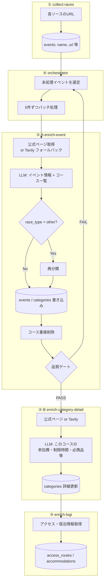

# バックエンド処理フロー（概要）

クロール・データ収集の処理の流れ。詳細は各スクリプトの設計書を参照。

---

## スクリプト構成

| # | スクリプト | 役割 | 設計書 |
|---|------------|------|--------|
| ① | `collect-races.js` | 各ソースからレース名・URL を収集 → events に投入 | [SPEC_CRAWL_COLLECT_RACES.md](./SPEC_CRAWL_COLLECT_RACES.md) |
| ②-A | `enrich-event.js` | 公式ページ + LLM でイベント基本情報・コース一覧を収集 | [SPEC_CRAWL_ENRICH_EVENT.md](./SPEC_CRAWL_ENRICH_EVENT.md) |
| ②-B | `enrich-category-detail.js` | コース単位で詳細情報（参加費・制限時間・必携品等）を収集 | [SPEC_CRAWL_ENRICH_CATEGORY_DETAIL.md](./SPEC_CRAWL_ENRICH_CATEGORY_DETAIL.md) |
| ③ | `enrich-logi.js` | アクセス・宿泊情報を収集（東京起点） | [SPEC_CRAWL_ENRICH_LOGI.md](./SPEC_CRAWL_ENRICH_LOGI.md) |
| ④ | `orchestrator.js` | ②-A → ②-B → ③ を順に呼び出す司令塔 | [SPEC_CRAWL_ORCHESTRATOR.md](./SPEC_CRAWL_ORCHESTRATOR.md) |

ユーティリティ:

| スクリプト | 役割 |
|------------|------|
| `lib/enrich-utils.js` | ②-A / ②-B 共有のユーティリティ（HTML取得・LLM呼び出し・Tavily検索等） |
| `reclassify-other.js` | race_type=other の一括再分類（メンテナンス用） |
| `enrich-detail.js` | 旧版。②-A + ②-B を1スクリプトで実行（CLI後方互換用） |

---

## 全体フロー



### 1イベントあたりの処理順序

```
②-A enrichEvent     → イベント情報 + コース特定 + 品質ゲート
                        ↓
②-B enrichCategoryDetail × N → 各コースの詳細情報（1コース1LLM呼び出し）
                        ↓
③   enrichLogi       → アクセス・宿泊情報
```

---

## 実行順序

```bash
# 1. レース名収集
npm run crawl:collect

# 2. イベント情報・カテゴリ詳細・ロジ収集（オーケストレータ経由）
npm run crawl:orchestrate
```

---

## 設計原則

### コース vs 申込区分

**コース**（categories テーブルに格納）:
- 距離・ルートが異なるもの（例: フルマラソン / ハーフマラソン / 10km）

**申込区分**（格納しない）:
- 同じコースの性別/年齢/会員種別の違い（例: 男子10km / 女子10km / R.LEAGUE 10km）
- Wave start の違い（例: Wave 1 / Wave 2）
- エントリー時期の違い（例: 早期申込 / 通常申込 / レイトエントリー）

### 品質ゲート

②-A 完了時に品質チェックを行い、最低限の情報（コース + 距離）が取れていない場合は完了扱いにしない。3回失敗で `enrich_quality = 'low'` フラグを付けて強制通過（無限ループ防止）。

---

## 関連ドキュメント

- [SPEC_CRAWL_COLLECT_RACES.md](./SPEC_CRAWL_COLLECT_RACES.md)
- [SPEC_CRAWL_ENRICH_EVENT.md](./SPEC_CRAWL_ENRICH_EVENT.md)
- [SPEC_CRAWL_ENRICH_CATEGORY_DETAIL.md](./SPEC_CRAWL_ENRICH_CATEGORY_DETAIL.md)
- [SPEC_CRAWL_ENRICH_DETAIL.md](./SPEC_CRAWL_ENRICH_DETAIL.md)（旧版・後方互換）
- [SPEC_CRAWL_ENRICH_LOGI.md](./SPEC_CRAWL_ENRICH_LOGI.md)
- [SPEC_CRAWL_ORCHESTRATOR.md](./SPEC_CRAWL_ORCHESTRATOR.md)
- [SPEC_DATA_SOURCES.md](./SPEC_DATA_SOURCES.md)
- [SPEC_RACE_DATA.md](./SPEC_RACE_DATA.md)
