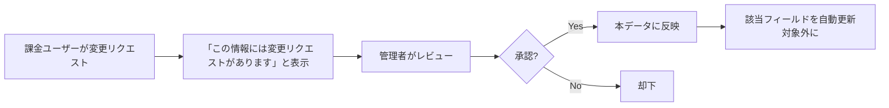
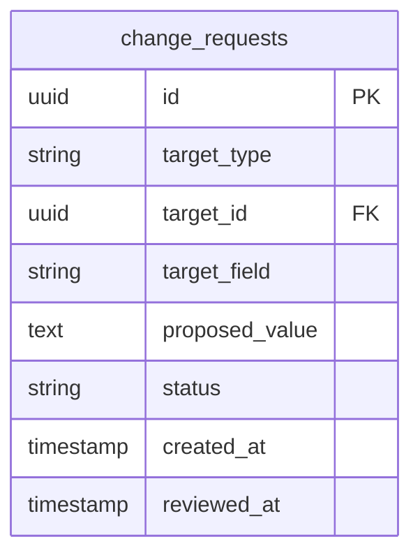

# 課金・変更リクエスト仕様

## 基本方針

- **課金ユーザー**: 情報の変更リクエストを出せる
- **コミュニティノート的**: ユーザーからの訂正・補足が反映される仕組み
- **承認済みは自動更新対象外**: 承認された変更は収集プログラムで上書きしない
- **個人情報は一切持たない**: セキュリティ最優先

---

## 変更リクエストの流れ

---

## 機能概要

### 1. 変更リクエストの提出（課金ユーザー）

- 大会・カテゴリ・アクセス等の各項目に対して「こうあるべき」を提案できる
- 例: 「申込み終了は3/15ではなく3/20です」「シャトルバスがあります」

### 2. 変更リクエストの表示

- 該当する情報に「この情報にはユーザーからの変更リクエストが上がっています」と表示
- 未承認のリクエスト一覧を管理者が確認できる

### 3. 承認後の扱い

- 承認された変更は本データに反映
- **該当フィールドは自動更新の対象外**とする
- 収集プログラムの UPSERT 時に、`manual_override` フラグが立っているフィールドは上書きしない

### 4. コミュニティノートとの類似

- 公式情報をユーザーが訂正・補足する
- 承認プロセスを経て反映
- 反映後は「ユーザー由来の情報」として扱い、自動収集で上書きしない

---

## データ構造（変更リクエスト）

| フィールド | 説明 |
|------------|------|
| target_type | `event` / `category` / `access_route` / `accommodation` 等 |
| target_id | 対象レコードのID |
| target_field | 対象フィールド名（例: `entry_end`, `shuttle_available`） |
| proposed_value | 提案値 |
| status | `pending` / `approved` / `rejected` |

### 自動更新除外フラグ

各テーブルに、フィールド単位で「手動更新済み（自動上書きしない）」を記録する。

- 案1: `events` 等に `manual_override_fields` (JSONB) で `["entry_end", "shuttle_available"]` のように保持
- 案2: 別テーブル `field_overrides` で `(table, record_id, field_name)` を管理

---

## 個人情報について（必須）

**個人情報は一切持たない。**

| 持たないもの | 理由 |
|--------------|------|
| メールアドレス | 漏洩リスク |
| 氏名 | 同上 |
| 住所 | 同上 |
| 電話番号 | 同上 |
| その他識別子 | 最小限に |

### 課金まわりの設計

- 決済は Stripe 等の外部サービスに委譲
- 当システムは「課金済みかどうか」のフラグのみ保持（Stripe の customer_id 等、必要最小限）
- 変更リクエストは**匿名**で提出。誰が提出したかは保持しない（課金ユーザーであることの確認のみ）

### セキュリティ原則

- 設計・実装の判断基準: 「個人情報を保存する必要があるか？」→ 基本的に No
- 将来的な機能追加時も、この原則を優先する
