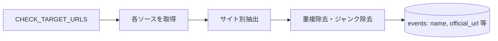

# ① レース名収集スクリプト設計

スクリプト: `scripts/crawl/collect-races.js`

---

## 役割

各ソース（CHECK_TARGET_URLS.md）からレース名・URL を収集し、`events` テーブルに投入する。
**カテゴリや詳細情報の取得はスコープ外。**

---

## フロー



---

## 入力

- `docs/data-sources/CHECK_TARGET_URLS.md` — チェック対象 URL 一覧

## 出力（DB）

`yabai_travel.events` に以下を INSERT（official_url が既存の場合はスキップ）:

| カラム | 説明 |
|--------|------|
| name | 大会名 |
| event_date | 開催日（取れれば） |
| official_url | 公式 URL（識別キー） |
| entry_url | 申込 URL |
| race_type | レース種別 |
| location / country | 開催地（取れれば） |

---

## ソース別の取得方式

| ソース | 方式 |
|--------|------|
| Spartan | `/en/race/find-race` からレース URL を一括取得 |
| UTMB | 専用抽出スクリプト（extract-utmb.js） |
| HYROX | 専用抽出スクリプト（extract-hyrox.js） |
| Strong Viking | 専用抽出スクリプト（extract-strong-viking.js） |
| Golden Trail | 専用抽出スクリプト（extract-golden-trail.js） |
| A Extremo | 専用抽出スクリプト（extract-a-extremo.js） |
| Devils Circuit | cheerio でヘッダから都市名を抽出 |
| RUNNET | 検索結果ページから `a[href*="Detail"]` を収集 |
| スポーツエントリー | トップから `a[href*="/event/"]` を収集 |
| Tough Mudder | `a[href*="/events/"]` を収集 |

---

## 実行方法

```bash
npm run crawl:collect          # 全件
npm run crawl:collect -- --dry-run  # DB更新なし（確認用）
npm run crawl:collect -- --limit 5  # 最初の5件のみ
```

---

## 関連ドキュメント

- [SPEC_CRAWL_ENRICH_DETAIL.md](./SPEC_CRAWL_ENRICH_DETAIL.md) — ② 詳細収集
- [SPEC_CRAWL_ORCHESTRATOR.md](./SPEC_CRAWL_ORCHESTRATOR.md) — ④ オーケストレータ
- [SPEC_DATA_SOURCES.md](./SPEC_DATA_SOURCES.md) — ソース一覧・追加方針
