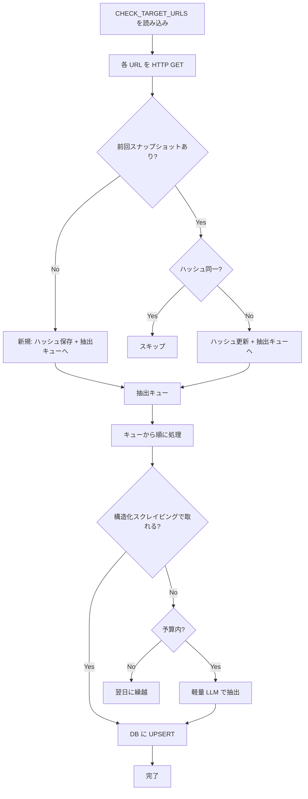

# 日次クロール・データ収集設計

毎日チェック対象 URL を巡回し、**新規発表**を取得・**既存レースの更新**を検知するロジックの設計。  
**コストを抑えつつ**運用可能な方式を採用する。

---

## 1. 前提・制約

| 項目 | 内容 |
|------|------|
| チェック対象 | [CHECK_TARGET_URLS.md](./data-sources/CHECK_TARGET_URLS.md) に集約（50+ URL） |
| 目的 | 新規レースの取得、既存レースの更新検知 |
| 制約 | Gemini API + Grounding は数時間で1万超の課金実績あり → **使わない** |
| 方針 | 確定情報のみ格納、既存は上書きしない（[SPEC_DATA_STRUCTURE](./SPEC_DATA_STRUCTURE.md) 準拠） |

---

## 2. 基本方針：**変更検知ファースト**

**「変わっていないページには一切コストをかけない」** が原則。

```
┌─────────────────────────────────────────────────────────────────┐
│  Phase 1: フェッチ（無料）                                        │
│  → 全対象 URL を HTTP GET                                         │
└─────────────────────────────────────────────────────────────────┘
                              ↓
┌─────────────────────────────────────────────────────────────────┐
│  Phase 2: 変更検知（無料）                                        │
│  → コンテンツハッシュまたは「リスト署名」を比較                     │
│  → 同一 → スキップ（終了）                                        │
│  → 差分あり → Phase 3 へ                                          │
└─────────────────────────────────────────────────────────────────┘
                              ↓
┌─────────────────────────────────────────────────────────────────┐
│  Phase 3: 抽出（コスト発生箇所）                                   │
│  → 変更があったページのみ処理                                      │
│  → 優先: 構造化スクレイピング（無料）                              │
│  → 補助: 軽量 LLM（Gemini Flash 等、安価）                         │
│  → 禁止: Grounding / Search（高額）                               │
└─────────────────────────────────────────────────────────────────┘
```

---

## 3. 変更検知の設計

### 3.1 ハッシュベース

| 方式 | 説明 | メリット | デメリット |
|------|------|----------|------------|
| 全文ハッシュ | HTML 全体の SHA256 | 実装が簡単 | 広告・日付などで毎回変わる可能性 |
| 正規化ハッシュ | レース一覧部分のみ抽出してハッシュ | ノイズに強い | 抽出ロジックが必要 |
| リスト署名 | レース名・URL・日付の一覧を正規化してハッシュ | 意味のある差分のみ検知 | 実装がやや重い |

**推奨**: まず **正規化ハッシュ** を採用。  
レース一覧のコンテナ（例: `#races`, `.event-list` 等）を抽出し、その部分のハッシュを比較。  
サイトごとにセレクタを定義するだけなので、LLM 不要。

### 3.2 保存するもの

```sql
-- 例: crawl_snapshots テーブル
CREATE TABLE crawl_snapshots (
  id UUID PRIMARY KEY,
  source_url TEXT NOT NULL,
  content_hash TEXT NOT NULL,
  content_length INT,
  fetched_at TIMESTAMPTZ NOT NULL,
  UNIQUE(source_url)
);
```

- 前回の `content_hash` と比較
- 同一 → スキップ
- 異なる → 抽出処理をトリガー

---

## 4. 抽出戦略（コスト抑制の核心）

### 4.1 優先順位

| 優先度 | 方式 | コスト | 適用場面 |
|--------|------|--------|----------|
| 1 | 構造化スクレイピング（Cheerio / Playwright） | 無料 | サイト構造が安定している場合 |
| 2 | 正規表現・部分抽出 | 無料 | レース名・日付・URL がパターン化している場合 |
| 3 | 軽量 LLM（Gemini Flash, Claude Haiku） | 安価 | 構造が複雑・不定形の場合 |
| 4 | **Grounding / Search** | **高額** | **使用禁止**（バッチ処理では） |

### 4.2 サイト別の想定

| ソース | 想定方式 | 備考 |
|--------|----------|------|
| Spartan 地域別 | 同一テンプレート想定 → セレクタで一括 | 46 URL だが構造は同じ |
| UTMB World Series | 一覧ページの構造を解析 → セレクタ | 英語、比較的整理されている |
| Golden Trail | 同上 | レース数少なめ |
| RUNNET | 検索結果・一覧の HTML 構造を解析 | 日本語、要調査 |
| スポーツエントリー | 同上 | 同上 |
| LAWSON DO! SPORTS | 同上 | 同上 |
| HYROX | Find My Race の一覧 | 英語 |
| A-Extremo | 静的リスト | 5大会程度、シンプル |

**方針**: 各ソースごとに「抽出スクリプト」を用意。  
まずはセレクタ・正規表現で試し、取れない部分だけ LLM に投げる（[SPEC_AI_USAGE](./SPEC_AI_USAGE.md) の「LLM は補助のみ」に準拠）。

### 4.3 LLM を使う場合のコスト制御

- **モデル**: Gemini Flash または Claude Haiku（1K tokens あたり数円以下）
- **入力**: 変更があったページの HTML の**該当部分のみ**（全文投げない）
- **Grounding 禁止**: 検索・リアルタイム情報取得は使わない
- **1日あたり予算**: 例) 500 円上限で停止
- **バッチサイズ**: 変更があったページを最大 N 件/日まで処理（例: 10 件）

---

## 5. 実行フロー（日次）



---

## 6. 技術スタック案

| 役割 | 候補 | 理由 |
|------|------|------|
| クローラー | axios / node-fetch | シンプルな GET で十分なサイトが多い |
| JS レンダリング | Playwright | SPA 等で必要になった場合のみ |
| HTML 解析 | Cheerio | 軽量、Node で定番 |
| ハッシュ | crypto.createHash('sha256') | 標準ライブラリ |
| スケジューラ | GitHub Actions (cron) / Vercel Cron | 日次実行 |
| DB | Supabase（既存） | スナップショット・イベントデータ |

---

## 7. 段階的実装

### Phase A: 変更検知のみ（LLM ゼロ）

1. 全対象 URL をフェッチ
2. レース一覧らしき部分をセレクタで抽出（仮でよい）
3. ハッシュを保存・比較
4. 「変更あり」をログ出力するだけ

→ **コストゼロ**で、どの URL がどれくらい変わるか把握できる。

### Phase B: 1ソースで抽出まで

1. 構造が単純なソース（例: A-Extremo や Golden Trail）を選ぶ
2. セレクタでレース名・URL・日付を抽出
3. DB に UPSERT
4. 変更検知と連携

→ **コストゼロ**で、1ソース分の自動収集を実現。

### Phase C: 複数ソース・LLM 補助

1. 構造が複雑なソースで、取れない項目を LLM に補助させる
2. 予算キャップ・バッチ制限を実装
3. 監視・アラート

---

## 8. やってはいけないこと

| 禁止事項 | 理由 |
|----------|------|
| 全ページに LLM をかける | コスト爆発 |
| Grounding / Search をバッチで使う | 数時間で1万超の実績あり |
| 変更検知なしで毎回抽出 | 無駄な API 呼び出し |
| HTML 全文を LLM に投げる | トークン消費が大きい |
| 並列度を上げすぎる | レート制限・IP ブロックのリスク |

---

## 9. 関連ドキュメント

- [CHECK_TARGET_URLS.md](./data-sources/CHECK_TARGET_URLS.md) — チェック対象 URL 一覧
- [SPEC_AI_USAGE.md](./SPEC_AI_USAGE.md) — 生成 AI 利用方針
- [SPEC_DATA_STRUCTURE.md](./SPEC_DATA_STRUCTURE.md) — データ構造・格納原則
- [SPEC_RACE_DATA.md](./SPEC_RACE_DATA.md) — 大会データ項目仕様
