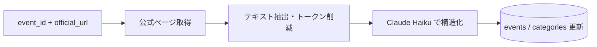

# ② 詳細収集スクリプト設計

スクリプト: `scripts/crawl/enrich-detail.js`

---

## 役割

オーケストレータから1件のイベント（event_id + official_url）を受け取り、
公式ページを取得 → LLM で解析 → `events` / `categories` を更新する。

---

## フロー



---

## 入力

コマンドライン引数または標準入力で以下を受け取る:

```
node enrich-detail.js --event-id <uuid> --url <official_url>
```

もしくはオーケストレータから直接呼び出し（JSON を stdin 等で渡す）。

## 出力（DB）

| テーブル | 更新内容 |
|----------|----------|
| `yabai_travel.events` | entry_start/end, reception_place, start_place, country 等を UPDATE |
| `yabai_travel.categories` | カテゴリを UPSERT（name をキーに）|

---

## LLM プロンプト

モデル: `claude-haiku-4-5-20251001`（コスト重視）

抽出対象:

```json
{
  "event": {
    "name": "正式な大会名",
    "event_date": "YYYY-MM-DD",
    "event_date_end": "YYYY-MM-DD（複数日の場合）",
    "location": "開催地",
    "country": "国名（日本語）",
    "race_type": "spartan|trail|hyrox|...|other",
    "entry_url": "申込URL",
    "entry_start": "YYYY-MM-DD",
    "entry_end": "YYYY-MM-DD",
    "reception_place": "受付場所",
    "start_place": "スタート場所"
  },
  "categories": [
    {
      "name": "カテゴリ名",
      "distance_km": 数値,
      "elevation_gain": 数値,
      "entry_fee": 数値,
      "entry_fee_currency": "JPY|USD|...",
      "start_time": "HH:MM",
      "time_limit": "HH:MM:SS",
      "mandatory_gear": "必携品リスト"
    }
  ]
}
```

ルール: ページに記載がない項目は null。推測しない。JSON のみ返す。

---

## 失敗・スキップ判定

- ページ取得失敗（タイムアウト・4xx/5xx）→ エラーログ、オーケストレータが再試行
- LLM が JSON を返さない → エラーログ、再試行対象
- 処理完了後: `events.collected_at` を現在時刻で UPDATE（完了マーク）

---

## 実行方法

```bash
# 単体実行（テスト用）
node scripts/crawl/enrich-detail.js --event-id <uuid> --url <url>

# 通常はオーケストレータ経由で実行
npm run crawl:orchestrate
```

---

## 関連ドキュメント

- [SPEC_CRAWL_COLLECT_RACES.md](./SPEC_CRAWL_COLLECT_RACES.md) — ① レース名収集
- [SPEC_CRAWL_ENRICH_LOGI.md](./SPEC_CRAWL_ENRICH_LOGI.md) — ③ ロジ収集
- [SPEC_CRAWL_ORCHESTRATOR.md](./SPEC_CRAWL_ORCHESTRATOR.md) — ④ オーケストレータ
- [SPEC_RACE_DATA.md](./SPEC_RACE_DATA.md) — 項目仕様
