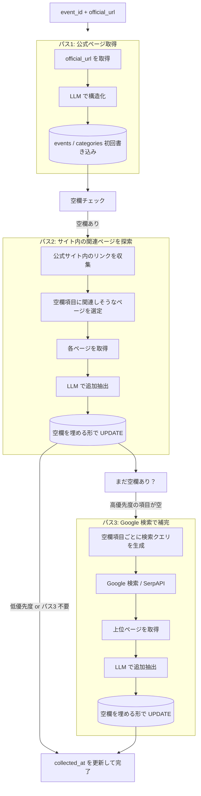

# ② 詳細収集スクリプト設計

スクリプト: `scripts/crawl/enrich-detail.js`

---

## 役割

オーケストレータから1件のイベント（event_id + official_url）を受け取り、
公式ページおよび関連ページを取得 → LLM で解析 → `events` / `categories` を更新する。

**1ページで完結しない情報（別ページ・Google検索で補完できる項目）は、積極的に探しに行く。**

---

## フロー



---

## 入力

コマンドライン引数または標準入力で以下を受け取る:

```
node enrich-detail.js --event-id <uuid> --url <official_url>
```

もしくはオーケストレータから直接呼び出し（JSON を stdin 等で渡す）。

---

## 出力（DB）

| テーブル | 更新内容 |
|----------|----------|
| `yabai_travel.events` | entry_start/end, reception_place, start_place, country 等を UPDATE |
| `yabai_travel.categories` | カテゴリを UPSERT（name をキーに）|

---

## 空欄チェック対象と優先度

パス1 完了後に以下の項目が null かどうかを確認し、パス2/3 に進むか判断する。

| 優先度 | 項目 | 典型的な場所 |
|--------|------|-------------|
| 高 | `categories[].distance_km` | コース紹介ページ、FAQ |
| 高 | `categories[].time_limit` | コース紹介ページ、ルールページ |
| 高 | `categories[].entry_fee` | 申込ページ、料金ページ |
| 高 | `categories[].start_time` | スケジュールページ |
| 高 | `event.entry_start` / `entry_end` | 申込ページ、ニュース |
| 中 | `categories[].mandatory_gear` | 必携品・装備ページ、ルールページ |
| 中 | `categories[].cutoff_times` | コース紹介ページ |
| 中 | `event.reception_place` / `start_place` | アクセス・会場ページ |
| 低 | `categories[].elevation_gain` | コース紹介ページ |
| 低 | `categories[].poles_allowed` | ルールページ |

**高優先度がすべて埋まっていればパス3（Google検索）はスキップしてよい。**

---

## パス2: サイト内の関連ページ探索

公式サイト内のリンクから、空欄項目に関連するページを選定して取得する。

### ページ選定のヒント（URL パターン）

| キーワード | 対象項目 |
|-----------|---------|
| `/course`, `/race`, `/distance` | distance_km, elevation_gain, time_limit, cutoff |
| `/rule`, `/regulation`, `/gear`, `/equipment` | mandatory_gear, poles_allowed |
| `/schedule`, `/timetable`, `/program` | start_time |
| `/entry`, `/register`, `/price`, `/fee` | entry_fee, entry_start, entry_end |
| `/access`, `/venue`, `/location` | reception_place, start_place |

LLM に「このサイトのどのリンクが〇〇の情報を持ちそうか」を聞いて選定しても良い。
1イベントあたり最大3〜5ページまで。

---

## パス3: Google 検索で補完

パス2 後も高優先度項目が空の場合に実行する。

### 検索クエリの生成例

| 空欄項目 | クエリ例 |
|---------|---------|
| `distance_km` が空 | `"レース名" distance km course |
| `entry_fee` が空 | `"レース名" 2026 entry fee price` |
| `mandatory_gear` が空 | `"レース名" mandatory gear required equipment` |
| `start_time` が空 | `"レース名" 2026 start time schedule` |

- 検索API: SerpAPI または Google Custom Search API（要APIキー）
- 取得する上位件数: 3件まで
- 公式サイトと同じドメインのページは除外（パス2で取得済みのため）

---

## LLM プロンプト

モデル: `claude-haiku-4-5-20251001`（コスト重視）

### パス1・2 の抽出対象（共通）

```json
{
  "event": {
    "name": "正式な大会名",
    "event_date": "YYYY-MM-DD",
    "event_date_end": "YYYY-MM-DD（複数日の場合）",
    "location": "開催地",
    "country": "国名（日本語）",
    "race_type": "spartan|trail|hyrox|devils_circuit|strong_viking|adventure|marathon|triathlon|obstacle|other",
    "entry_url": "申込URL",
    "entry_start": "YYYY-MM-DD",
    "entry_end": "YYYY-MM-DD",
    "reception_place": "受付場所",
    "start_place": "スタート場所"
  },
  "categories": [
    {
      "name": "カテゴリ名",
      "distance_km": 数値,
      "elevation_gain": 数値,
      "entry_fee": 数値,
      "entry_fee_currency": "JPY|USD|EUR|...",
      "start_time": "HH:MM",
      "time_limit": "HH:MM:SS",
      "cutoff_times": [{ "point": "地点名", "time": "HH:MM" }],
      "mandatory_gear": "必携品リスト",
      "poles_allowed": true/false
    }
  ]
}
```

ルール: ページに記載がない項目は null。推測しない。JSON のみ返す。

### パス3（Google検索結果）の抽出

空欄項目のみを対象に絞ったプロンプトを使う（コスト削減）。

---

## UPDATE 戦略

- **null のカラムのみ更新**（既に値が入っている項目は上書きしない）
- パス1→2→3 の順に徐々に埋めていく

```sql
-- 例: distance_km が null の場合のみ更新
UPDATE yabai_travel.categories
SET distance_km = $1
WHERE id = $2 AND distance_km IS NULL
```

---

## 失敗・スキップ判定

- ページ取得失敗（タイムアウト・4xx/5xx）→ エラーログ、オーケストレータが再試行
- LLM が JSON を返さない → エラーログ、再試行対象
- パス2/3 の追加ページ取得失敗 → スキップしてパス1 の結果で完了とする
- 処理完了後: `events.collected_at` を現在時刻で UPDATE（完了マーク）

---

## コスト管理

| パス | LLM 呼び出し | 想定トークン |
|------|------------|------------|
| パス1 | 1回 | 〜5,000 |
| パス2 | 最大5回 | 〜25,000 |
| パス3 | 必要な項目数だけ | 〜10,000 |

Haiku 換算で1イベントあたり概算 $0.01〜$0.05 程度。
コスト上限を設けてパス2/3 を打ち切る設計も検討する。

---

## 実行方法

```bash
# 単体実行（テスト用）
node scripts/crawl/enrich-detail.js --event-id <uuid> --url <url>

# 通常はオーケストレータ経由で実行
npm run crawl:orchestrate
```

---

## 関連ドキュメント

- [SPEC_CRAWL_COLLECT_RACES.md](./SPEC_CRAWL_COLLECT_RACES.md) — ① レース名収集
- [SPEC_CRAWL_ENRICH_LOGI.md](./SPEC_CRAWL_ENRICH_LOGI.md) — ③ ロジ収集
- [SPEC_CRAWL_ORCHESTRATOR.md](./SPEC_CRAWL_ORCHESTRATOR.md) — ④ オーケストレータ
- [SPEC_RACE_DATA.md](./SPEC_RACE_DATA.md) — 項目仕様
