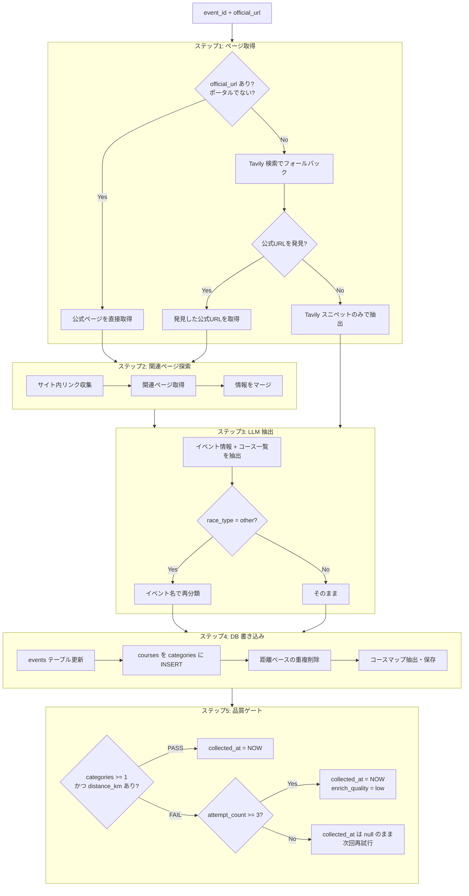

# ②-A イベント情報・コース特定スクリプト設計

スクリプト: `scripts/crawl/enrich-event.js`

---

## 役割

オーケストレータから1件のイベント（event_id + official_url）を受け取り、
公式ページまたは Tavily 検索から**イベント基本情報**と**ユニークコース一覧**を抽出する。

**カテゴリ単位の詳細情報（参加費・制限時間・必携品等）は本スクリプトでは収集しない。**
それは ②-B `enrich-category-detail.js` の役割。

---

## フロー



---

## LLM プロンプト（イベント専用）

モデル: `claude-haiku-4-5-20251001`

### 抽出対象

```json
{
  "event": {
    "name": "正式な大会名",
    "event_date": "YYYY-MM-DD（開催初日）",
    "event_date_end": "YYYY-MM-DD（複数日の場合の最終日）",
    "location": "開催地（自治体名を含む）",
    "country": "国名（日本語）",
    "race_type": "分類基準に従って判定",
    "official_url": "大会の公式サイトURL",
    "entry_url": "申込URL",
    "entry_start": "YYYY-MM-DD",
    "entry_end": "YYYY-MM-DD",
    "reception_place": "受付場所",
    "start_place": "スタート場所",
    "weather_forecast": "開催時期の気候",
    "visa_info": "ビザ情報（海外レースのみ）",
    "recovery_facilities": "リカバリー施設",
    "photo_spots": "フォトスポット"
  },
  "courses": [
    { "name": "コース名", "distance_km": 数値 }
  ]
}
```

### コース特定のルール

**重要**: `courses` はユニークなコース（ルート・距離が異なるもの）のみを出力する。

以下は**コースの違いではない**ため、1つにまとめること:
- 申込区分の違い（一般 / R.LEAGUE / 早期エントリー / レイトエントリー）
- 性別区分（男子 / 女子）
- 年齢区分（一般 / マスターズ / ジュニア / 親子）
- Wave start の違い（Wave 1 / Wave 2 / ...）

例:
- 「10km A組(男子)」「10km B組(女子)」「【R.LEAGUE】10km」→ `{ "name": "10km", "distance_km": 10 }` として1つ
- 「フルマラソン」「ハーフマラソン」「10km」→ 3つの別コース

---

## コース重複削除ロジック

LLM 抽出後、同一 event_id × 同一 distance_km のカテゴリが複数ある場合:
- 最もシンプルな名前（文字数が最短）のレコードを残す
- 他を DELETE

```sql
DELETE FROM categories WHERE id IN (
  SELECT id FROM (
    SELECT id, ROW_NUMBER() OVER (
      PARTITION BY event_id, distance_km
      ORDER BY LENGTH(name) ASC
    ) as rn
    FROM categories WHERE event_id = $1 AND distance_km IS NOT NULL
  ) sub WHERE rn > 1
)
```

---

## 品質ゲート

| 条件 | 結果 |
|------|------|
| categories >= 1 AND distance_km が1件以上 | PASS → `collected_at = NOW()` |
| 上記を満たさない AND attempt_count < 3 | FAIL → `enrich_attempt_count += 1`、次回再試行 |
| 上記を満たさない AND attempt_count >= 3 | PASS（強制） → `collected_at = NOW(), enrich_quality = 'low'` |

---

## Tavily フォールバックの改善点

旧 enrich-detail.js との違い:

| 項目 | 旧（enrich-detail.js） | 新（enrich-event.js） |
|------|----------------------|---------------------|
| Tavily で公式URL発見時 | スニペットのみで抽出 | 発見URLを fetch → 関連ページ探索も実行 |
| パス2（関連ページ） | Tavily パスではスキップ | 公式URL取得できれば実行 |
| moshicom.com | ポータル認識されない | PORTAL_DOMAINS に追加済み |

---

## 入出力

### 入力
```
node scripts/crawl/enrich-event.js --event-id <uuid>
node scripts/crawl/enrich-event.js --dry-run --limit 5
```

### 出力（DB）

| テーブル | 更新内容 |
|----------|----------|
| `events` | 基本情報を COALESCE UPDATE |
| `categories` | コース名 + distance_km のみ INSERT |
| `course_map_files` | コースマップ画像/PDF を保存 |

### 戻り値
```javascript
{ success: boolean, eventId: string, location?: string, categoriesCount?: number }
```

---

## 関連ドキュメント

- [SPEC_CRAWL_ENRICH_CATEGORY_DETAIL.md](./SPEC_CRAWL_ENRICH_CATEGORY_DETAIL.md) — ②-B カテゴリ詳細収集
- [SPEC_CRAWL_ORCHESTRATOR.md](./SPEC_CRAWL_ORCHESTRATOR.md) — ④ オーケストレータ
- [SPEC_BACKEND_FLOW.md](./SPEC_BACKEND_FLOW.md) — 全体フロー
