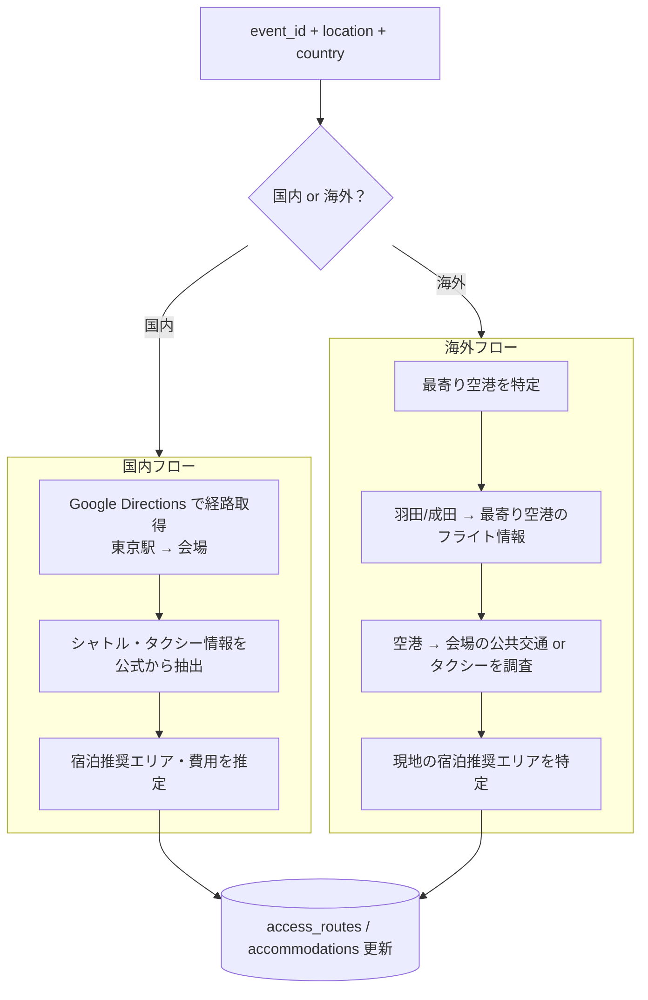

# ③ ロジ収集スクリプト設計

スクリプト: `scripts/crawl/enrich-logi.js`

---

## 役割

オーケストレータから1件のイベントを受け取り、
**東京起点**のアクセス・宿泊情報を取得して `access_routes` / `accommodations` を更新する。

国内・海外問わず全レースが対象。海外レースは「どの空港に飛ぶか」から始まる経路を提供する。

---

## フロー



---

## 入力

```
node enrich-logi.js --event-id <uuid> --location <location> --country <country>
```

---

## 出力（DB）

| テーブル | 更新内容 |
|----------|----------|
| `yabai_travel.access_routes` | 往路・復路の経路・所要時間・費用・シャトル・タクシー等 |
| `yabai_travel.accommodations` | 前泊推奨エリア・宿泊費用目安（星3） |

---

## 国内レースのアクセス情報

**起点: 東京駅**

### 取得方針

| 項目 | 取得方法 |
|------|---------|
| 経路・乗り換え | Google Directions API（公共交通モード） |
| 所要時間 | Google Directions API |
| 費用概算 | Google Directions API（運賃情報）or LLM 推定 |
| 現金必須区間 | LLM（公式ページ・路線情報から判断） |
| シャトルバス | 公式ページから LLM 抽出 |
| タクシー | 最寄り駅〜会場の距離・費用を Google Maps で推定 |

### 往路・復路

- **往路**: 東京駅発 → 大会スタート地点着（前日夜 or 当日早朝）
- **復路**: フィニッシュ地点発 → 東京駅着（レース終了後）

---

## 海外レースのアクセス情報

**起点: 羽田空港 / 成田空港（どちらが便利か含めて案内）**

### 取得フロー

#### Step 1: 最寄り空港の特定

LLM に「〇〇（location）に最も近い主要国際空港はどこか」を質問。
複数ある場合は主要2〜3空港を列挙。

#### Step 2: フライト情報

以下を LLM で調査:

| 項目 | 内容 |
|------|------|
| 出発空港 | 羽田 / 成田（就航状況で判断） |
| 到着空港 | Step 1 で特定した最寄り空港 |
| 所要時間 | フライト時間（乗り継ぎがある場合は合計） |
| 乗り継ぎ | 経由地・乗り継ぎ便の有無 |
| 費用感 | エコノミーの目安（「〇万円台〜」程度で十分） |

※ 具体的な便名・時刻は変動するので「目安」として扱う。
※ LLM のハルシネーションが出やすい項目なので、「一般的な情報として」という前置きをつける。

#### Step 3: 空港 → 会場のアクセス

公式ページの「Access」「Getting There」「How to Get Here」等のページを探し、LLM で抽出。
なければ Google Directions API（電車・バスモード）または LLM 推定。

| 項目 | 内容 |
|------|------|
| 公共交通 | 電車・地下鉄・バス等のルートと所要時間 |
| タクシー | 空港 or 最寄り駅から会場までの目安費用・距離 |
| シャトル | 大会公式シャトルの有無 |
| Uber / Grab 等 | 配車アプリが使えるかどうか（地域情報として） |

#### Step 4: 宿泊推奨エリア

- 空港近く（早朝フライトなら前泊）
- 会場近く（前泊必須の場合）
- 現地の宿泊費用目安（星3相当）

---

## 取得方針まとめ

### 案A: Google Directions API（推奨）

- 国内・空港〜会場の経路に使用
- 精度が高く、乗り換え・費用も取れる
- API キーが必要（要事前設定）
- コスト: 1リクエスト $0.005〜

### 案B: LLM（Claude）で調査

- フライト情報・海外の公共交通・シャトル・Uber等に使用
- ハルシネーションリスクあり → 「目安情報」として扱い、ユーザーに「要確認」を明示
- 既存の ANTHROPIC_API_KEY を流用

### 運用方針

**国内**: Google Directions API（経路）+ LLM（シャトル・タクシー）
**海外**: LLM（フライト・空港〜会場）+ Google Directions API（可能なら空港〜会場）

Google API キーがない場合は全て LLM にフォールバック。

---

## 「目安情報」の明示

海外フライト情報や LLM 由来の情報は、DB に保存する際に `route_detail` の末尾に以下を付記する:

```
※ この情報は目安です。実際のフライト・交通手段は出発前にご確認ください。
```

---

## スキップ条件

- `location` が null → スキップ
- ~~海外レースはスキップ~~ → **全レース対象に変更**

---

## 失敗・スキップ判定

- Google API 失敗 → LLM にフォールバック
- LLM 失敗 → エラーログ、オーケストレータが再試行
- 処理完了後: `access_routes` に1件以上 INSERT できれば完了とする

---

## 未決事項

- [ ] Google Directions API キーの取得・設定（ユーザー側で取得が必要）
- [ ] 海外フライト情報の精度をどこまで担保するか（LLM 推定で許容するか）
- [ ] 宿泊費用の取得元（Google Hotels API / LLM 推定 等）
- [ ] Uber / Grab 等の配車アプリ情報をどの地域に対して提供するか

---

## 実行方法

```bash
# 単体実行（テスト用）
node scripts/crawl/enrich-logi.js --event-id <uuid> --location <location> --country <country>

# 通常はオーケストレータ経由で実行
npm run crawl:orchestrate
```

---

## 関連ドキュメント

- [SPEC_CRAWL_ORCHESTRATOR.md](./SPEC_CRAWL_ORCHESTRATOR.md) — ④ オーケストレータ
- [SPEC_CRAWL_ENRICH_DETAIL.md](./SPEC_CRAWL_ENRICH_DETAIL.md) — ② 詳細収集
- [SPEC_RACE_DATA.md](./SPEC_RACE_DATA.md) — access_routes / accommodations 項目仕様
