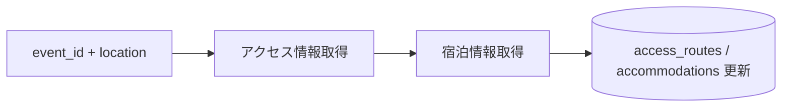

# ③ ロジ収集スクリプト設計

スクリプト: `scripts/crawl/enrich-logi.js`

---

## 役割

オーケストレータから1件のイベントを受け取り、
東京起点のアクセス・宿泊情報を取得して `access_routes` / `accommodations` を更新する。

---

## フロー



---

## 入力

```
node enrich-logi.js --event-id <uuid> --location <location>
```

## 出力（DB）

| テーブル | 更新内容 |
|----------|----------|
| `yabai_travel.access_routes` | 往路・復路の経路・所要時間・費用・シャトル・タクシー等 |
| `yabai_travel.accommodations` | 前泊推奨エリア・宿泊費用目安（星3） |

---

## 取得方針（検討中）

### 案A: Google Directions API
- 精度が高い
- API キーが必要（要事前設定）
- コスト: スタンダードプランで 1リクエスト $0.005〜

### 案B: LLM（Claude）に経路を質問
- API キー不要（既存の ANTHROPIC_API_KEY を流用）
- ハルシネーションリスクあり（存在しないバスや時刻を返す可能性）
- 「東京から〇〇への公共交通機関での経路を教えて」形式

### 案C: ハイブリッド（推奨）
- Google Directions API で経路・時間・費用を取得
- LLM でシャトルバス・タクシー情報を公式ページから抽出
- Google API キーがない場合は案B にフォールバック

---

## 失敗・スキップ判定

- 海外レース（country が日本以外）→ スキップ（東京起点では無意味）
- location が null → スキップ
- 処理完了後: 何らかのマーク（TBD）で完了を記録

---

## 実行方法

```bash
# 単体実行（テスト用）
node scripts/crawl/enrich-logi.js --event-id <uuid> --location <location>

# 通常はオーケストレータ経由で実行
npm run crawl:orchestrate
```

---

## 未決事項

- [ ] Google Directions API を使うか決める（APIキー取得が必要）
- [ ] 国内レースのみ対象にするか、海外も含めるか
- [ ] 宿泊費用の取得元（じゃらん API / Google Hotels / LLM推定 等）

---

## 関連ドキュメント

- [SPEC_CRAWL_ORCHESTRATOR.md](./SPEC_CRAWL_ORCHESTRATOR.md) — ④ オーケストレータ
- [SPEC_CRAWL_ENRICH_DETAIL.md](./SPEC_CRAWL_ENRICH_DETAIL.md) — ② 詳細収集
- [SPEC_RACE_DATA.md](./SPEC_RACE_DATA.md) — access_routes / accommodations 項目仕様
