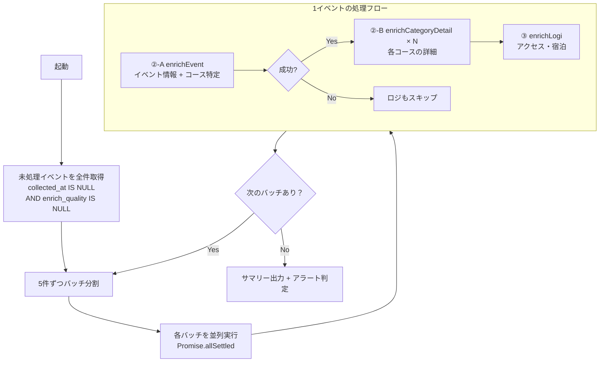

# ④ オーケストレータ設計

スクリプト: `scripts/crawl/orchestrator.js`
実行基盤: GitHub Actions（`crawl-enrich.yml`）

---

## 役割

②-A イベント情報収集・②-B カテゴリ詳細収集・③ ロジ収集を順に呼び出す司令塔。
「未処理のイベント」を全件対象に、並列5件で処理する。

---

## フロー



---

## 処理対象の選定

```sql
SELECT id, name, official_url, location, country
FROM yabai_travel.events
WHERE (
  collected_at IS NULL
  OR event_date IS NULL
  OR location IS NULL
  OR country IS NULL
  OR race_type IS NULL
)
AND (enrich_quality IS NULL OR enrich_quality != 'low')
AND (last_attempted_at IS NULL OR last_attempted_at < NOW() - INTERVAL '7 days')
ORDER BY
  CASE WHEN collected_at IS NULL THEN 0 ELSE 1 END,
  updated_at ASC
```

`enrich_quality = 'low'` のイベントは除外（3回失敗で品質ゲート強制通過済み）。

---

## 1イベントあたりの処理フロー

```javascript
// ②-A: イベント情報 + コース特定
const eventResult = await enrichEvent(event, { dryRun })

if (eventResult.success) {
  // ②-B: 各コースの詳細収集（詳細未収集のもの）
  const categories = await fetchPendingCategories(event.id)
  for (const cat of categories) {
    await enrichCategoryDetail(event, cat, { dryRun })
  }
}

// ③: ロジ収集（②-A の location を使用）
const enrichedEvent = { ...event, location: eventResult.location || event.location }
await enrichLogi(enrichedEvent, { dryRun })
```

---

## 並列実行設計

- **並列数**: 5件同時（LLM の rate limit を考慮）
- `Promise.allSettled` を使用（1件失敗しても残りを継続）
- バッチ間ウェイト: 3秒（Anthropic API レートリミット対策）

---

## 完了・失敗の記録

| ステップ | 成功時 | 失敗時 |
|---------|--------|--------|
| ②-A enrichEvent | `collected_at = NOW()`（品質ゲート通過時） | `enrich_attempt_count += 1`, `last_attempted_at = NOW()` |
| ②-B enrichCategoryDetail | categories の各フィールド更新 | ログ出力のみ（次回再試行） |
| ③ enrichLogi | `access_routes` / `accommodations` に INSERT | ログ出力のみ |

---

## アラート

詳細エンリッチ（②-A）の失敗率が 50% 以上の場合、GitHub Issue を自動起票。

---

## 実行方法

```bash
# 手動実行（全未処理を処理）
node scripts/crawl/orchestrator.js

# オプション
node scripts/crawl/orchestrator.js --concurrency 10  # 並列数変更
node scripts/crawl/orchestrator.js --dry-run          # DB更新なし
node scripts/crawl/orchestrator.js --once             # 1バッチだけ

# GitHub Actions から手動トリガー
gh workflow run crawl-enrich.yml
```

---

## 関連ドキュメント

- [SPEC_CRAWL_COLLECT_RACES.md](./SPEC_CRAWL_COLLECT_RACES.md) — ① レース名収集
- [SPEC_CRAWL_ENRICH_EVENT.md](./SPEC_CRAWL_ENRICH_EVENT.md) — ②-A イベント情報・コース特定
- [SPEC_CRAWL_ENRICH_CATEGORY_DETAIL.md](./SPEC_CRAWL_ENRICH_CATEGORY_DETAIL.md) — ②-B カテゴリ詳細収集
- [SPEC_CRAWL_ENRICH_LOGI.md](./SPEC_CRAWL_ENRICH_LOGI.md) — ③ ロジ収集
