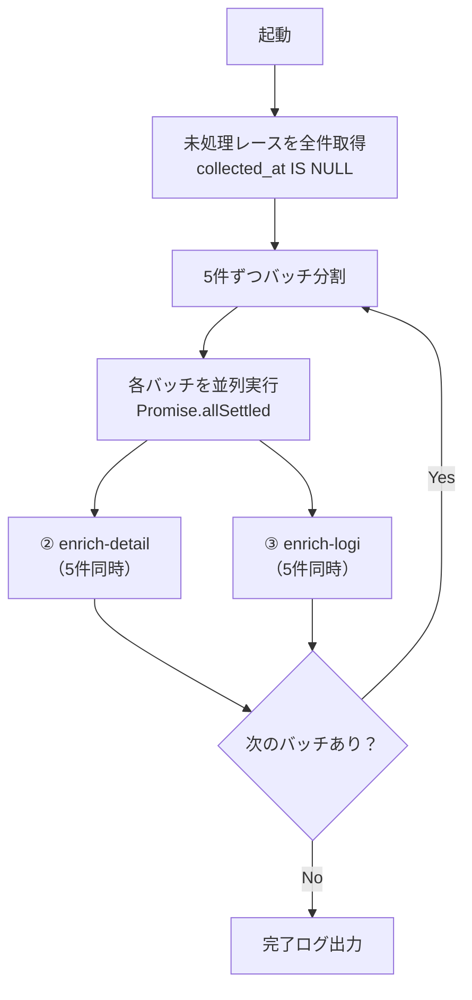

# ④ オーケストレータ設計

スクリプト: `scripts/crawl/orchestrator.js`
実行基盤: GitHub Actions（`crawl.yml`）

---

## 役割

② 詳細収集・③ ロジ収集を並列で呼び出す司令塔。
「未処理のレース」を全件対象に、並列5件で一気に処理する。

---

## フロー



---

## 処理対象の選定

```sql
-- 未処理（詳細未取得）のレース全件
SELECT id, name, official_url, location, country
FROM yabai_travel.events
WHERE collected_at IS NULL
ORDER BY created_at ASC
```

リミットなし。1回の実行で全未処理を消化する。

---

## 並列実行設計

- **並列数**: 5件同時（LLM の rate limit を考慮）
- **② と ③ は独立して並列実行**（どちらかが失敗しても影響しない）
- `Promise.allSettled` を使用（1件失敗しても残りを継続）

```js
// イメージ
const batches = chunk(pendingEvents, 5)
for (const batch of batches) {
  await Promise.allSettled(
    batch.flatMap(event => [
      enrichDetail(event),
      enrichLogi(event),
    ])
  )
}
```

---

## 完了・失敗の記録

| 状態 | 記録方法 |
|------|----------|
| ② 完了 | `events.collected_at = NOW()` |
| ② 失敗 | `collected_at` は null のまま（次回実行で再試行） |
| ③ 完了 | `access_routes` に1件以上 INSERT されれば完了 |
| ③ 失敗 | 記録なし（次回実行で再試行） |

---

## 実行基盤: GitHub Actions（`crawl.yml`）

### トリガー

| トリガー | タイミング |
|---------|-----------|
| 手動（`workflow_dispatch`） | 随時 |
| 定期（`schedule`） | 毎日深夜2時（JST）= 17:00 UTC |

### ジョブ構成

```
job 1: collect-races
  → scripts/crawl/collect-races.js を実行
  → 所要時間: 10〜15分

job 2: enrich（collect-races 完了後に起動）
  needs: collect-races
  → scripts/crawl/orchestrator.js を実行
  → 全未処理を並列5件で消化
  → 所要時間: 件数次第（100件で1〜2時間、500件で5〜10時間）
  → timeout: 300分（GitHub Actions 最大6時間以内）
```

### コスト目安（GitHub Actions）

| プラン | 無料枠 | 想定消費 |
|--------|--------|---------|
| Free / private repo | 2,000分/月 | 100件/回 × 月数回 = 300〜600分 |
| 超過時 | $0.008/分 | ほぼかからない想定 |

---

## ワークフローファイル設計（`crawl.yml`）

```yaml
name: Crawl & Enrich

on:
  workflow_dispatch:   # 手動実行
  schedule:
    - cron: '0 17 * * *'  # 毎日 02:00 JST

jobs:
  collect-races:
    runs-on: ubuntu-latest
    timeout-minutes: 30
    steps:
      - uses: actions/checkout@v4
      - uses: actions/setup-node@v4
        with: { node-version: '20' }
      - run: npm ci
      - run: node scripts/crawl/collect-races.js
        env:
          DATABASE_URL: ${{ secrets.DATABASE_URL }}
          ANTHROPIC_API_KEY: ${{ secrets.ANTHROPIC_API_KEY }}

  enrich:
    needs: collect-races
    runs-on: ubuntu-latest
    timeout-minutes: 300
    steps:
      - uses: actions/checkout@v4
      - uses: actions/setup-node@v4
        with: { node-version: '20' }
      - run: npm ci
      - run: node scripts/crawl/orchestrator.js
        env:
          DATABASE_URL: ${{ secrets.DATABASE_URL }}
          ANTHROPIC_API_KEY: ${{ secrets.ANTHROPIC_API_KEY }}
          GOOGLE_DIRECTIONS_API_KEY: ${{ secrets.GOOGLE_DIRECTIONS_API_KEY }}
```

---

## 実行方法

```bash
# 手動実行（ローカル・全未処理を処理）
node scripts/crawl/orchestrator.js

# オプション
node scripts/crawl/orchestrator.js --concurrency 10  # 並列数を増やす
node scripts/crawl/orchestrator.js --dry-run          # DB更新なし
node scripts/crawl/orchestrator.js --once             # 1バッチだけ実行

# GitHub Actions から手動トリガー
gh workflow run crawl.yml
```

---

## 関連ドキュメント

- [SPEC_CRAWL_COLLECT_RACES.md](./SPEC_CRAWL_COLLECT_RACES.md) — ① レース名収集
- [SPEC_CRAWL_ENRICH_DETAIL.md](./SPEC_CRAWL_ENRICH_DETAIL.md) — ② 詳細収集
- [SPEC_CRAWL_ENRICH_LOGI.md](./SPEC_CRAWL_ENRICH_LOGI.md) — ③ ロジ収集
