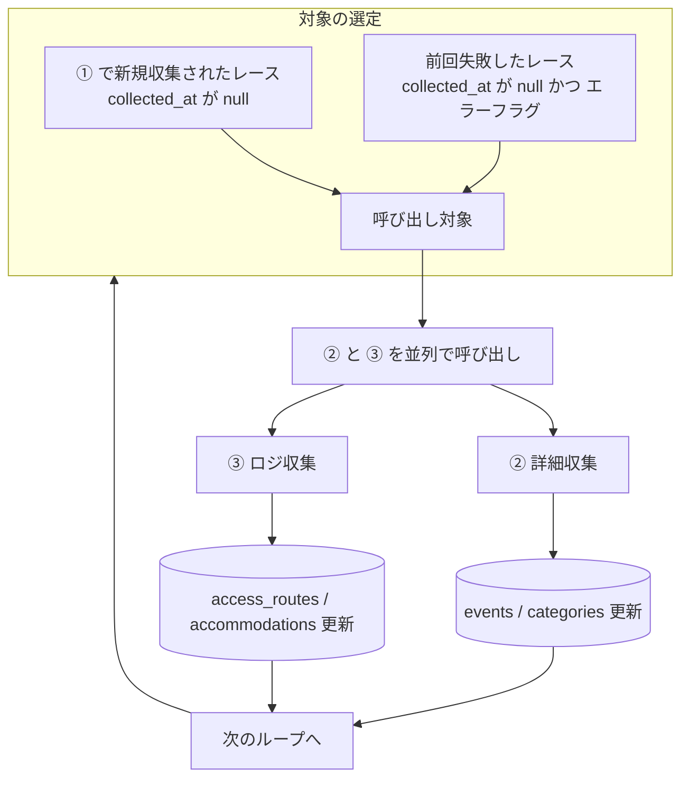

# ④ オーケストレータ設計

スクリプト: `scripts/crawl/orchestrator.js`

---

## 役割

② 詳細収集・③ ロジ収集を呼び出す司令塔。
「未処理のレース」と「失敗したレース」を対象に、延々ループして処理を回す。

---

## フロー



---

## 処理対象の選定ロジック

```sql
-- 未処理（詳細未取得）のレース
SELECT id, official_url, location
FROM yabai_travel.events
WHERE collected_at IS NULL
ORDER BY created_at ASC
LIMIT 10  -- 1ループあたりの処理件数
```

---

## 実行方式

- ② と ③ を **並列**（Promise.allSettled）で呼び出す
- 子の処理がタイムアウトしても次のループへ進む
- 1ループあたり N 件を処理（デフォルト: 10件）

---

## 完了・失敗の記録

| 状態 | 記録方法 |
|------|----------|
| ② 完了 | `events.collected_at = NOW()` |
| ② 失敗 | collected_at は null のまま（次回ループで再試行） |
| ③ 完了 | `access_routes` に1件以上存在すれば完了とみなす |
| ③ 失敗 | 記録なし（次回ループで再試行） |

---

## 実行方法

```bash
npm run crawl:orchestrate          # 未処理を延々処理
npm run crawl:orchestrate -- --once  # 1ループだけ実行して終了
npm run crawl:orchestrate -- --limit 5  # 1ループあたり5件
```

---

## トリガー

| トリガー | 方式 |
|---------|------|
| 手動 | `npm run crawl:orchestrate` |
| 定期実行 | GitHub Actions `workflow_dispatch` / cron（将来） |

① レース名収集とは独立して実行する。① の後に手動で回すのが基本運用。

---

## 関連ドキュメント

- [SPEC_CRAWL_COLLECT_RACES.md](./SPEC_CRAWL_COLLECT_RACES.md) — ① レース名収集
- [SPEC_CRAWL_ENRICH_DETAIL.md](./SPEC_CRAWL_ENRICH_DETAIL.md) — ② 詳細収集
- [SPEC_CRAWL_ENRICH_LOGI.md](./SPEC_CRAWL_ENRICH_LOGI.md) — ③ ロジ収集
