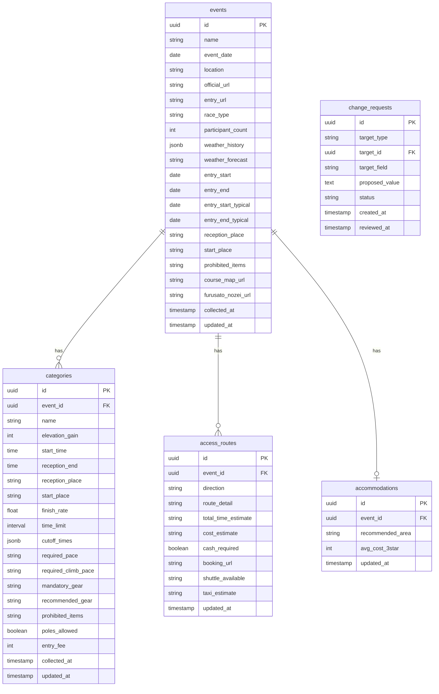
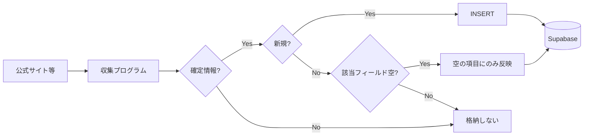

# データ構造設計

大会データのテーブル構成。**確定情報のみ格納**し、**更新は原則発生しない**設計。

**Supabase**: Organization / Project は共通利用。当アプリは専用スキーマ（例: `yabai_travel`）でテーブルを管理する。

---

## ER 図（概念）

---

## テーブル概要

### events（大会）

1大会 = 1レコード。日付・場所・URL・天気・申込み期間（大会共通）等。

| 設計上のポイント | 内容 |
|------------------|------|
| 識別子 | 公式URL または 大会名+日付 でユニーク判定 |
| 格納ルール | **確定情報のみ**。不確かなものは格納しない |
| コースマップ | `course_map_files` テーブルでサイト内にファイル保持。レース終了後も参照可能 |
| 例年の申込日 | `entry_start_typical` / `entry_end_typical` は具体的な日付（YYYY-MM-DD）で保持。今年の申込開始の目安 |
| トータル費用 | `total_cost_estimate` で申込+交通+宿泊の合計概算を表示 |
| 過去開催 | `event_series_id` で同一レースの複数年版を紐付け。去年のコースマップ・料金・申込日を参照可能 |

### categories（カテゴリ）

1カテゴリ = 1レコード。`event_id` で大会に紐づく。

| 設計上のポイント | 内容 |
|------------------|------|
| カットオフ | `cutoff_times` は JSONB で `[{ "point": "Aid1", "time": "10:00" }, ...]` 等 |
| ポール | `poles_allowed` はトレラン以外は NULL 可 |
| 申込み費用 | カテゴリ毎に異なる場合はここに保持 |

### access_routes（アクセス）

往路・復路を `direction: "outbound" | "return"` で区別。大会単位。`route_detail` に経路・乗り換え情報、`total_time_estimate` にトータル時間の目安を保持。

### accommodations（宿泊）

前泊推奨地・費用目安。大会単位。

### change_requests（変更リクエスト）

課金ユーザーからの情報訂正・補足の提案。承認後は本データに反映。詳細は [課金・変更リクエスト仕様](./SPEC_BILLING_AND_CHANGE_REQUESTS.md)。

---

## 収集・格納の原則

### 1. 確定情報のみ格納

- **確定** = 公式で発表されている情報
- 不確かな情報は DB に格納しない
- これにより **更新は原則発生しない**（間違ったデータを入れないため）

### 2. 新規は INSERT、既存は上書きしない

- **新規レコード**: INSERT
- **既存レコード**: **上書きしない**。空のフィールドを埋める追加のみ可

### 3. 空の項目を埋める（追加で探しに行く）

- データが取れなかった項目は、別ソースを探しに行って取得するのは **あり**
- 取得できた確定情報を、空のフィールドに **追加**する
- 既に値があるフィールドは触らない

### 4. 識別キー

| テーブル | 識別キー | 備考 |
|----------|----------|------|
| events | `(official_url)` または `(name, event_date)` | URL が安定していれば URL 優先 |
| categories | `(event_id, name)` | 同一大会内でカテゴリ名は一意と仮定 |

### 5. 収集メタデータ

`collected_at` でいつ取得したかを記録。空の項目が残っている場合は、追加収集の対象として扱う。

### 6. 取得元の方針

- **手動入力はなし**
- API が使える項目は API で取得
- 基本は Google（検索・Maps・Directions 等）が主なソースになる想定

---

## データ収集フロー（想定）

- 確定情報のみ格納
- 既存データの上書きはしない
- 空の項目は、**追加で探しに行って**埋める（別ソースを検索する等）
