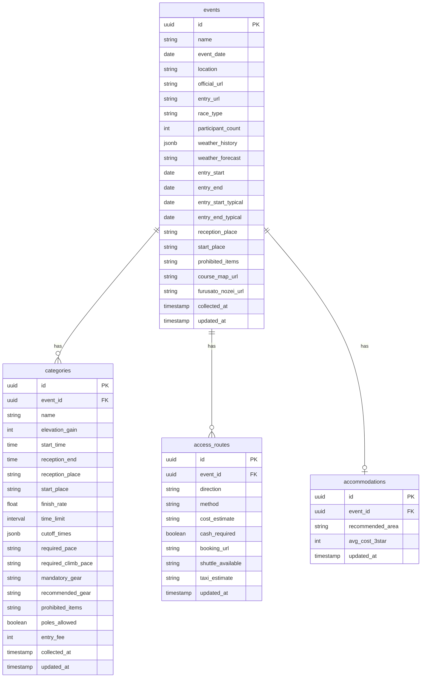
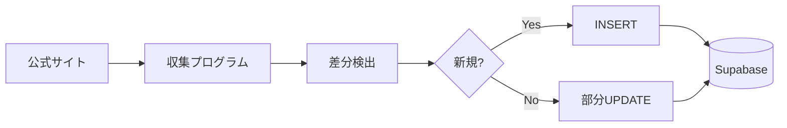

# データ構造設計

大会データのテーブル構成と、随時アップデートのための設計。

---

## ER 図（概念）



---

## テーブル概要

### events（大会）

1大会 = 1レコード。日付・場所・URL・天気・申込み期間（大会共通）等。

| 設計上のポイント | 内容 |
|------------------|------|
| 識別子 | 公式URL または 大会名+日付 でユニーク判定。新規は INSERT、既存は UPDATE |
| コースマップ | `course_map_url` で Supabase Storage のパスを保持。画像/PDF をアップロード |
| 天気 | `weather_forecast` は開催日接近時に更新 |

### categories（カテゴリ）

1カテゴリ = 1レコード。`event_id` で大会に紐づく。

| 設計上のポイント | 内容 |
|------------------|------|
| カットオフ | `cutoff_times` は JSONB で `[{ "point": "Aid1", "time": "10:00" }, ...]` 等 |
| ポール | `poles_allowed` はトレラン以外は NULL 可 |
| 申込み費用 | カテゴリ毎に異なる場合はここに保持 |

### access_routes（アクセス）

往路・復路を `direction: "outbound" | "return"` で区別。大会単位。

### accommodations（宿泊）

前泊推奨地・費用目安。大会単位。

---

## 更新戦略（全件洗替しない設計）

### 1. 収集単位の分離

```
[収集プログラム] → 公式サイト等をクロール
         → 差分検出
         → レコード単位で UPSERT（存在すれば UPDATE、なければ INSERT）
```

### 2. 識別キー

| テーブル | 識別キー | 備考 |
|----------|----------|------|
| events | `(official_url)` または `(name, event_date)` | URL が安定していれば URL 優先 |
| categories | `(event_id, name)` | 同一大会内でカテゴリ名は一意と仮定 |

### 3. UPSERT のルール

- **新規**: 全フィールドを INSERT
- **既存**: 取得した値が **非 NULL** のフィールドのみ UPDATE
- **取得できなかった項目**: 既存の値を維持（上書きしない）

```sql
-- 例: events の部分更新
UPDATE events SET
  entry_start = COALESCE(incoming.entry_start, entry_start),
  entry_end = COALESCE(incoming.entry_end, entry_end),
  weather_forecast = COALESCE(incoming.weather_forecast, weather_forecast),
  updated_at = NOW()
WHERE id = ?
```

### 4. 収集メタデータ

各テーブルに `collected_at` / `updated_at` を保持し、

- いつ取得したか
- どの項目が未取得か

を追跡可能にする。将来的に「情報未確定」の表示にも利用。

### 5. バージョン管理（オプション）

変更履歴が必要な場合は、`event_snapshots` 等の履歴テーブルを別途用意し、`updated_at` 毎にスナップショットを保存する方式も検討可能。初期は `updated_at` のみで十分と想定。

---

## データ収集フロー（想定）



- 定期的にクロール（日次/週次等）
- 発表前は項目が空のまま登録し、情報が出るたびに部分更新
- 全件削除・全件再取得は行わない
